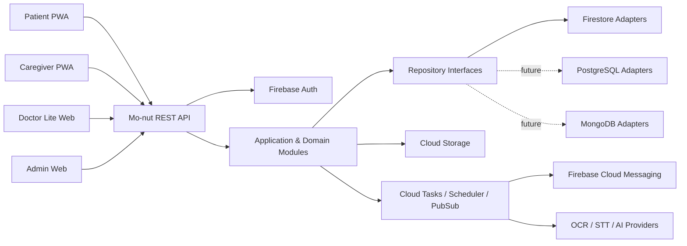
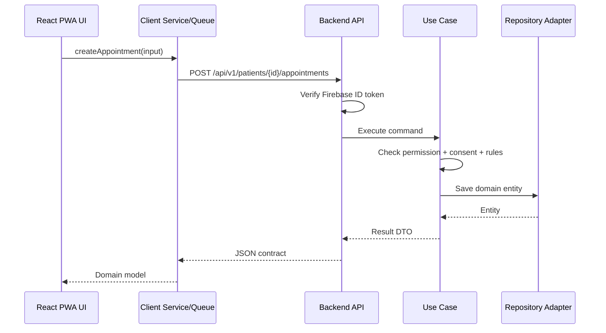
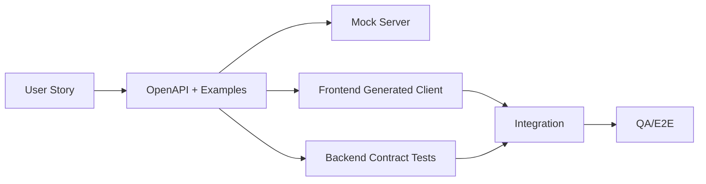
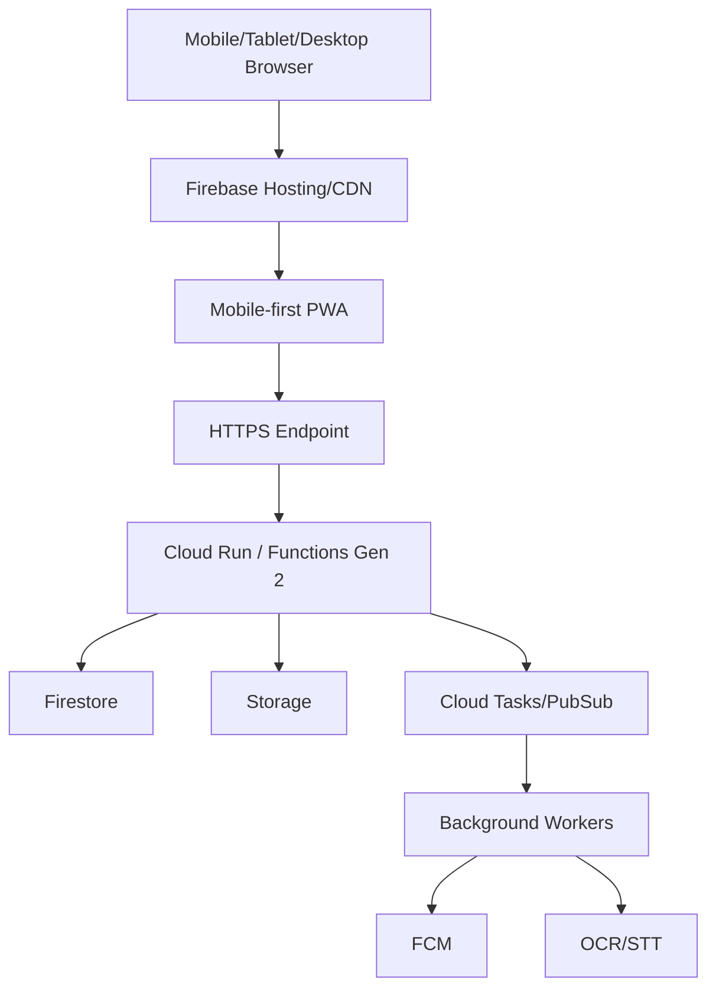

# 01 — Architecture

**Source:** `mo-nut-SRS-mobile-first-PWA.md` Sections 3, 9–13, 20–21 และ 29

## Architecture Goals

- พัฒนา Web Application แบบ Mobile-first PWA โดยใช้ Progressive Enhancement
- Frontend และ Backend ทำงานขนานกันผ่าน OpenAPI
- ใช้ Firebase เพื่อความเร็วของ MVP แต่ลด vendor lock-in
- แยก Domain Logic, Application Use Cases และ Infrastructure
- รองรับ Offline-aware workflows ผ่าน Service Worker, IndexedDB และ Sync Queue โดยไม่สมมติว่า Background Sync ใช้ได้ทุก Browser
- ปกป้องข้อมูลสุขภาพด้วย server-side authorization
- รองรับการย้าย Firestore ไป PostgreSQL หรือ MongoDB

## Proposed Stack

| Area | Choice | Rationale |
|---|---|---|
| Patient/Caregiver client | TypeScript + React/Next.js หรือ Framework เทียบเท่า | Mobile-first responsive web, SSR/CSR ตามหน้าที่ และ PWA จาก codebase เดียว |
| Doctor Lite/Admin | Web routes/modules แยกตาม role; deploy แยกได้เมื่อจำเป็น | MVP ยังไม่ใช่ Full Doctor Portal; reuse contract/design system |
| Backend | NestJS + TypeScript | Modular, DI, validation, OpenAPI |
| Runtime | Cloud Run หรือ Functions Gen 2 | Managed scale และ Firebase integration |
| Auth | Firebase Authentication | Email/password และ Google เป็น MUST; Phone OTP เป็น SHOULD เมื่อเปิด Provider |
| Primary DB | Cloud Firestore | MVP speed, managed service |
| File storage | Cloud Storage | Images, PDF, audio |
| Push | FCM Web Push + In-app | Web Push เป็น capability-dependent และ In-app เป็น baseline |
| PWA/Local DB | Web App Manifest + Service Worker + IndexedDB | App Shell, controlled cache, offline queue และ per-account data isolation |
| Contract | OpenAPI 3.1 | Generated clients และ mock server |

## System Context



## Layering

### Presentation Layer

- REST controllers
- Authentication middleware
- Request DTO validation
- HTTP error mapping
- OpenAPI annotations/spec

### Application Layer

- Use cases เช่น `CreateAppointment`, `ConfirmMedicationEvent`
- Transaction boundaries
- Permission and consent orchestration
- Calls to repositories and provider interfaces

### Domain Layer

- Entities, value objects, enums
- Invariants and domain services
- ไม่มี Firebase, HTTP หรือ database SDK

### Infrastructure Layer

- Firestore repositories
- Firebase Admin Auth adapter
- Storage adapter
- FCM adapter
- OCR/STT providers
- Logging and monitoring

## Backend Module Boundaries

```text
identity
patients
caregivers
appointments
medications
health
visits
media
checklists
questions
maps
sos
reports
notifications
consents
audit
admin
```

แต่ละ module ต้องมี `domain/`, `application/`, `infrastructure/`, `presentation/` และห้ามเข้าถึง collection ของ module อื่นโดยตรงนอก repository/use case ที่กำหนด

## Frontend Structure

```text
apps/web/src/
├── app/                  # routes, layouts, providers
├── components/           # accessible design system
├── core/
│   ├── api/              # generated OpenAPI client
│   ├── auth/
│   ├── pwa/              # manifest, service-worker registration
│   ├── offline/          # IndexedDB, cache policy, sync queue
│   ├── errors/
│   ├── i18n/
│   └── telemetry/
└── features/
    ├── appointments/
    ├── medications/
    ├── health/
    ├── caregivers/
    ├── checklists/
    ├── questions/
    ├── visit-mode/
    ├── reports/
    └── sos/
```

Feature ต้องแยก UI, application state/use cases, contract mapping และ storage adapter; component ห้ามเรียก Firebase/Firestore โดยตรง

## Request Flow



## Authentication and Session Model

- Client sign-in ผ่าน Firebase Auth
- Client ส่ง Firebase ID token ใน `Authorization: Bearer`
- Backend verify token ทุก request
- Domain user ID แยกจาก `firebaseUid`
- Custom claims ใช้เป็น coarse role hint เท่านั้น; permission จริงอ่านจาก domain data
- MFA บังคับสำหรับ Doctor/Admin เมื่อเปิด role เหล่านี้

## Data Storage Strategy

- Firestore top-level collections
- UUIDv7/ULID เป็น portable ID
- Foreign relation เก็บเป็น string ID
- ไม่ใช้ `DocumentReference`, Firestore `Timestamp` หรือ `GeoPoint` ใน domain DTO
- Files อยู่ Storage; metadata อยู่ database
- Audit และ event collections เป็น append-only

## PWA, Offline and Sync

- Web App Manifest กำหนด installability, icons, start URL, scope, safe area และ standalone mode
- Service Worker cache เฉพาะ versioned App Shell และข้อมูลที่นโยบายอนุญาต; PHI ใช้ Network First และ minimize cache
- IndexedDB แยก cache/pending operations ตาม account และ patient context
- Optimistic UI สำหรับ medication event และ measurement
- Offline mutation มี `client_mutation_id`; batch ผ่าน `POST /api/v1/sync/batch` และคืนผลรายรายการ
- Version field ใช้ optimistic concurrency
- Permission/account status ใช้ server-wins
- Conflict ที่อาจสูญเสียข้อมูลต้องให้ผู้ใช้ review
- Auto-sync เมื่อกลับ online/เปิดแอปเมื่อทำได้ พร้อมปุ่ม Sync เอง; ห้ามพึ่ง Background Sync เพียงช่องทางเดียว
- Logout ล้าง Offline Data ตามนโยบาย และห้ามล้าง pending item โดยไม่แจ้งผู้ใช้

## Background Jobs and Events

- Outbox event บันทึกใน transaction เดียวกับ state change
- Worker ประมวลผล notification, OCR, STT, report generation
- Retry ด้วย exponential backoff และ dead-letter handling
- Scheduled jobs สร้าง medication events และ appointment reminders

## Contract-first Parallel Development



ทุก feature ต้องกำหนด request, response, errors, permissions และ acceptance criteria ก่อน implement

## Deployment Topology



## Observability

- Structured JSON logs พร้อม requestId
- Cloud Monitoring metrics และ alerts
- Web error reporting, Core Web Vitals และ service-worker/sync failure metrics
- Sentry หรือเทียบเท่าเป็น option สำหรับ unified frontend tracing โดยต้อง redact PHI
- ห้าม log transcript, medication detail, access token หรือ raw PHI

## Scalability Considerations

- API stateless
- Pagination ทุก list
- Query-driven indexes
- Event/audit data แยก collection และเตรียม partition เมื่อย้าย SQL
- Large reports และ media processing ทำ async
- Tenant/organization ID อยู่ใน entity ที่เกี่ยวข้อง

## Key Tradeoffs

| Decision | Benefit | Cost/Risk |
|---|---|---|
| Mobile-first PWA | deploy เร็ว ไม่ต้องผ่าน App Store และใช้ codebase เดียว | Browser capability, Web Push และ background execution ไม่สม่ำเสมอ |
| Firestore | MVP เร็ว | joins/reporting จำกัดและมี migration cost |
| Backend-only data writes | security/portability | latency และงาน backend เพิ่ม |
| Offline-first | reliability | conflict/sync complexity |
| AI drafts with confirmation | safety | interaction เพิ่มหนึ่งขั้นตอน |

## Open Technical Decisions

1. React/Next.js baseline และ PWA/service-worker tooling ที่ใช้จริง
2. Cloud Run vs Functions Gen 2 เป็น default API runtime
3. Browser Support Policy และ fallback matrix
4. Provider สำหรับ OCR/STT และ data residency
5. Queue implementation: Cloud Tasks, Pub/Sub หรือ combination
6. Secret field-level encryption scope
