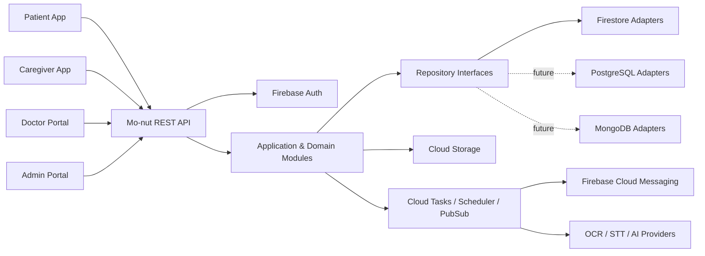
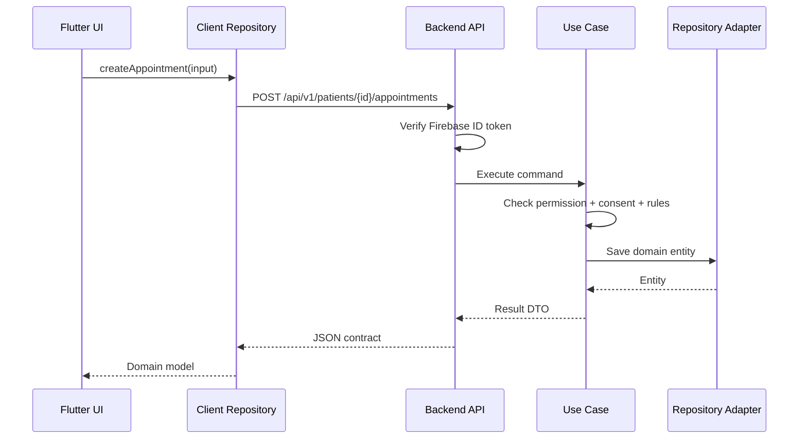
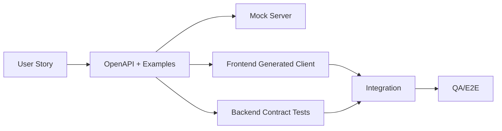
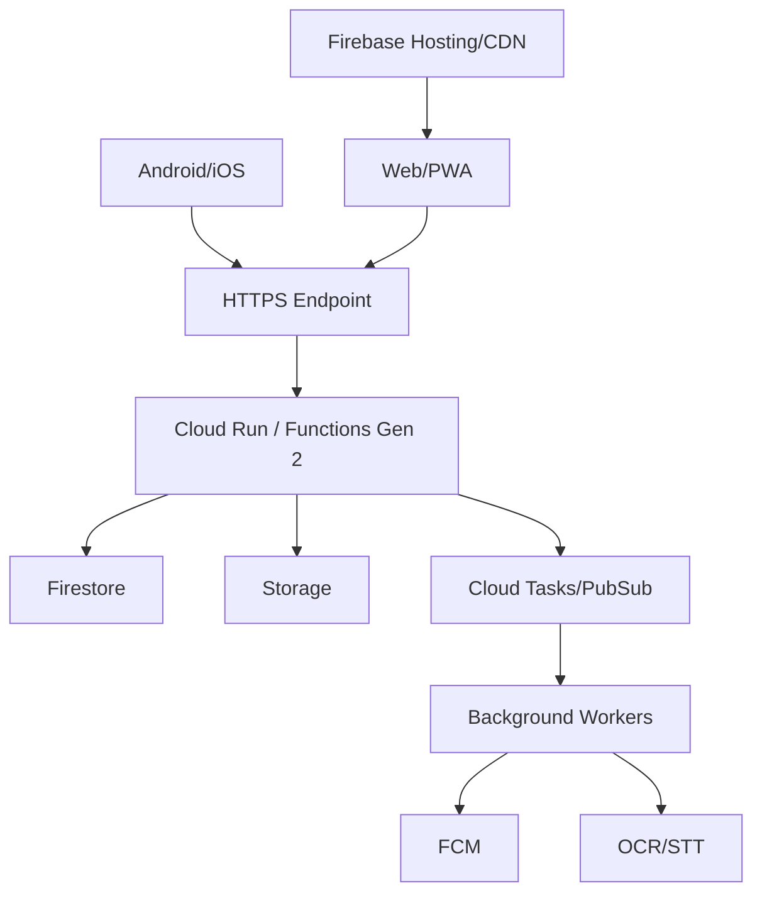

# 01 — Architecture

**Source:** SRS Sections 4–5, 10–19 และข้อกำหนด Cross-platform/Firebase/Database portability

## Architecture Goals

- พัฒนา Mobile/Web จาก codebase ร่วมกัน
- Frontend และ Backend ทำงานขนานกันผ่าน OpenAPI
- ใช้ Firebase เพื่อความเร็วของ MVP แต่ลด vendor lock-in
- แยก Domain Logic, Application Use Cases และ Infrastructure
- รองรับ Offline-first และ background jobs
- ปกป้องข้อมูลสุขภาพด้วย server-side authorization
- รองรับการย้าย Firestore ไป PostgreSQL หรือ MongoDB

## Proposed Stack

| Area | Choice | Rationale |
|---|---|---|
| Patient/Caregiver client | Flutter | Android, iOS, Web/PWA จาก codebase เดียว |
| Doctor/Admin portal | Flutter Web เริ่มต้น; Next.js เป็น option | เลือกตามความซับซ้อนของ data tables |
| Backend | NestJS + TypeScript | Modular, DI, validation, OpenAPI |
| Runtime | Cloud Run หรือ Functions Gen 2 | Managed scale และ Firebase integration |
| Auth | Firebase Authentication | Phone OTP, email, Google, Apple |
| Primary DB | Cloud Firestore | MVP speed, managed service |
| File storage | Cloud Storage | Images, PDF, audio |
| Push | FCM | Mobile/Web notification |
| Local DB | Drift/SQLite | Offline queue และ cache |
| Contract | OpenAPI 3.1 | Generated clients และ mock server |

## System Context



## Layering

### Presentation Layer

- REST controllers
- Authentication middleware
- Request DTO validation
- HTTP error mapping
- OpenAPI annotations/spec

### Application Layer

- Use cases เช่น `CreateAppointment`, `ConfirmMedicationEvent`
- Transaction boundaries
- Permission and consent orchestration
- Calls to repositories and provider interfaces

### Domain Layer

- Entities, value objects, enums
- Invariants and domain services
- ไม่มี Firebase, HTTP หรือ database SDK

### Infrastructure Layer

- Firestore repositories
- Firebase Admin Auth adapter
- Storage adapter
- FCM adapter
- OCR/STT providers
- Logging and monitoring

## Backend Module Boundaries

```text
identity
patients
caregivers
appointments
medications
health
visits
media
checklists
questions
maps
sos
reports
notifications
consents
audit
admin
```

แต่ละ module ต้องมี `domain/`, `application/`, `infrastructure/`, `presentation/` และห้ามเข้าถึง collection ของ module อื่นโดยตรงนอก repository/use case ที่กำหนด

## Frontend Structure

```text
lib/
├── app/
├── core/
│   ├── api/
│   ├── auth/
│   ├── database/
│   ├── design_system/
│   ├── errors/
│   ├── localization/
│   └── sync/
└── features/
    ├── appointments/
    ├── medications/
    ├── health/
    ├── caregivers/
    ├── checklists/
    ├── questions/
    ├── visit_mode/
    ├── reports/
    └── sos/
```

Feature ต้องแยก Presentation, Application/Controller, Domain model และ Data repository implementation

## Request Flow



## Authentication and Session Model

- Client sign-in ผ่าน Firebase Auth
- Client ส่ง Firebase ID token ใน `Authorization: Bearer`
- Backend verify token ทุก request
- Domain user ID แยกจาก `firebaseUid`
- Custom claims ใช้เป็น coarse role hint เท่านั้น; permission จริงอ่านจาก domain data
- MFA บังคับสำหรับ Doctor/Admin เมื่อเปิด role เหล่านี้

## Data Storage Strategy

- Firestore top-level collections
- UUIDv7/ULID เป็น portable ID
- Foreign relation เก็บเป็น string ID
- ไม่ใช้ `DocumentReference`, Firestore `Timestamp` หรือ `GeoPoint` ใน domain DTO
- Files อยู่ Storage; metadata อยู่ database
- Audit และ event collections เป็น append-only

## Offline and Sync

- Local SQLite เก็บ cache และ pending operations
- Optimistic UI สำหรับ medication event และ measurement
- Append-only command มี idempotency key
- Version field ใช้ optimistic concurrency
- Permission/account status ใช้ server-wins
- Conflict ที่อาจสูญเสียข้อมูลต้องให้ผู้ใช้ review

## Background Jobs and Events

- Outbox event บันทึกใน transaction เดียวกับ state change
- Worker ประมวลผล notification, OCR, STT, report generation
- Retry ด้วย exponential backoff และ dead-letter handling
- Scheduled jobs สร้าง medication events และ appointment reminders

## Contract-first Parallel Development



ทุก feature ต้องกำหนด request, response, errors, permissions และ acceptance criteria ก่อน implement

## Deployment Topology



## Observability

- Structured JSON logs พร้อม requestId
- Cloud Monitoring metrics และ alerts
- Crashlytics สำหรับ Flutter
- Sentry เป็น option หากต้องการ unified tracing
- ห้าม log transcript, medication detail, access token หรือ raw PHI

## Scalability Considerations

- API stateless
- Pagination ทุก list
- Query-driven indexes
- Event/audit data แยก collection และเตรียม partition เมื่อย้าย SQL
- Large reports และ media processing ทำ async
- Tenant/organization ID อยู่ใน entity ที่เกี่ยวข้อง

## Key Tradeoffs

| Decision | Benefit | Cost/Risk |
|---|---|---|
| Flutter | shared code | Web admin tables อาจไม่คล่องเท่า Next.js |
| Firestore | MVP เร็ว | joins/reporting จำกัดและมี migration cost |
| Backend-only data writes | security/portability | latency และงาน backend เพิ่ม |
| Offline-first | reliability | conflict/sync complexity |
| AI drafts with confirmation | safety | interaction เพิ่มหนึ่งขั้นตอน |

## Open Technical Decisions

1. Riverpod vs Bloc
2. Cloud Run vs Functions Gen 2 เป็น default API runtime
3. Flutter Web vs Next.js สำหรับ Admin Portal
4. Provider สำหรับ OCR/STT และ data residency
5. Queue implementation: Cloud Tasks, Pub/Sub หรือ combination
6. Secret field-level encryption scope
