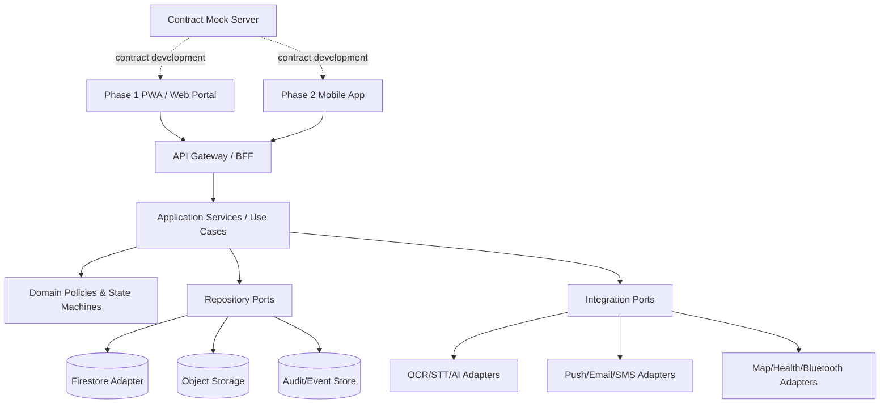
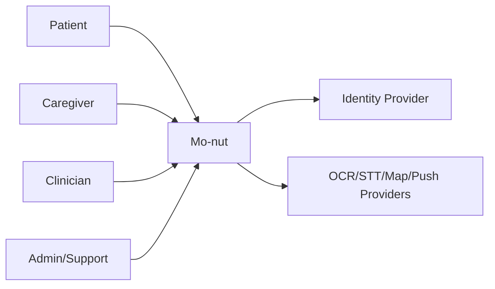
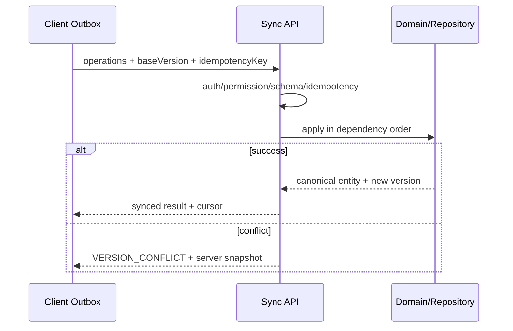
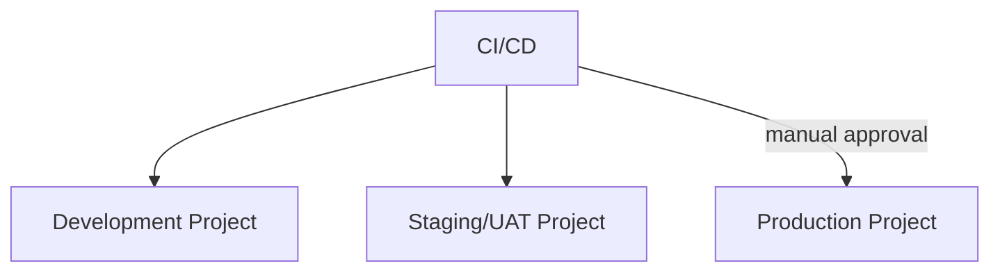

# 01 — Architecture

> **Source:** `mo-nut-SRS-two-phase.md` เวอร์ชัน 1.0, วันที่ 24 มิถุนายน 2026. เอกสารนี้ต้องอ่านร่วมกับไฟล์อื่นใน `docs/design/`

## 1. Architecture goals

- API-first, contract-first และ client-independent
- Business rules/authorization authoritative ที่ server
- Database-agnostic domain model
- Offline-aware, idempotent และ auditable
- รองรับ PWA และ Mobile App โดยไม่สร้าง backend ซ้ำ
- Privacy by Design, least privilege และ environment isolation
- ทำให้ทีม PWA, Backend, Mobile, QA และ AI integration ทำงานขนานกัน

## 2. Proposed logical architecture



## 3. Technology options

### 3.1 PWA framework — Open Decision

| Option | Strength | Tradeoff |
|---|---|---|
| Next.js + TypeScript | ecosystem, SSR/BFF support, routing/tooling | framework complexity; must avoid coupling BFF to domain |
| React + Vite + TypeScript | simple SPA/PWA and clear API boundary | SSR/SEO/edge features require additions |
| Nuxt + TypeScript | strong Vue DX and SSR/PWA options | team skill/ecosystem decision |

Selection criteria: accessibility, service-worker control, typed API generation, bundle size, team skill, long-term support และ test tooling

### 3.2 Mobile framework — Open Decision before Phase 2

| Option | Strength | Tradeoff |
|---|---|---|
| Flutter | consistent UI, strong cross-platform rendering | Dart stack separate from TypeScript packages |
| React Native | TypeScript sharing and ecosystem | native dependency/version management |

### 3.3 Backend compute

- Cloud Functions เหมาะกับ event-driven function ขนาดเล็ก
- Cloud Run เหมาะกับ versioned API, container control และ long-running/worker workloads
- การเลือกต้องทำราย service และบันทึก ADR

## 4. System context



## 5. Request/data flow

### Command flow

1. Client validates presentation-level input
2. Client sends token, correlation ID, app/platform version และ idempotency key เมื่อจำเป็น
3. API authenticates and resolves active role/patient context
4. Authorization checks role + consent + constraints
5. Application service validates state transition/business rule
6. Repository commits canonical entity/history/audit atomically where required
7. Server returns canonical entity/version
8. Client updates cache/local database

### OCR/STT flow

1. Client requests signed upload and uploads asset
2. API creates `DocumentAsset`/`AudioRecord`
3. Worker creates asynchronous `ProcessingJob`
4. Provider output is stored as `ExtractedDraft`
5. UI displays confidence and requires review
6. Only `confirmed` draft can be applied to Appointment/Medication/Checklist

### Offline sync flow



## 6. Frontend structure

- App shell, routing, role-aware navigation
- Feature modules aligned with SRS modules
- Generated API client; no direct Firestore query in UI
- Presentation state separated from server cache and offline outbox
- Shared design tokens and accessible components
- Capability service for camera, mic, notification, location, share and offline
- Error boundary, permission state, loading/empty/offline/conflict states

## 7. Backend/API structure

```text
transport/       HTTP handlers, auth middleware, request mapping
application/     use cases, transactions, orchestration
 domain/          entities, value objects, policies, state machines
 ports/           repository and provider interfaces
 adapters/        Firestore, Storage, OCR/STT, push, map
 workers/         notification, processing, report, retention jobs
 contracts/       OpenAPI, JSON Schema, enums, events
 observability/   structured logs, metrics, traces, audit events
```

## 8. Data storage

- Firestore เป็น initial primary store ผ่าน adapter เท่านั้น
- Object Storage เก็บ image/audio/PDF; database เก็บ metadata/checksum
- Audit/history เป็น append-oriented record
- Read models ใช้ denormalization ได้ แต่ต้อง rebuild ได้จาก source of truth
- Public API ใช้ ISO-8601 JSON types ไม่ส่ง Firebase-specific types

## 9. Authentication/session model

- External identity token exchanged for application session/claims
- One account can hold multiple roles; active context must be explicit
- Biometric is local unlock only; server credential remains token/session
- Device/session revocation supported
- High-risk/admin accounts require stronger authentication policy

## 10. Background jobs/events

| Job/Event | Trigger | Reliability rule |
|---|---|---|
| OCR/STT processing | Asset ready | async retry, timeout, provider metadata |
| Dose occurrence generation | Schedule/effective date | deterministic + idempotent |
| Notification delivery | appointment/dose/checklist event | delivery log + retry + escalation |
| Report generation | user request | async status + expiring asset |
| Retention cleanup | policy schedule | audit evidence; no legal-hold deletion |
| Read-model rebuild | domain change/recovery | repeatable and observable |

## 11. Search/cache/CDN

- Search engine: Not applicable yet; use scoped queries and indexed metadata until approved
- CDN: allowed for public/static assets; PHI assets require signed URLs and no public cache
- Client cache: must respect data classification and logout/device-revoke wipe rules
- Server cache: only for non-sensitive reference data unless threat model approves

## 12. Observability

- Correlation ID end-to-end
- Structured logs without unnecessary PHI
- Metrics: latency, error, queue age, notification delivery, OCR/STT failure, sync conflict
- Distributed trace sampling for API/workers
- Crash reporting for PWA/Mobile with redaction
- Security/audit events separated from product analytics

## 13. Deployment topology



Each environment must have separate identity project, database, bucket, secrets and provider credentials.

## 14. Scalability considerations

- Partition high-volume time-series by patient/time and index deliberate queries
- Async queue for OCR/STT, notifications and reports
- Batch notification with per-recipient idempotency
- Avoid unbounded arrays/nested documents
- Use cursor pagination and delta sync
- Cost/budget alerts for AI, SMS and storage

## 15. Key tradeoffs

| Decision direction | Benefit | Cost/Risk |
|---|---|---|
| API-only client | migration/security consistency | additional backend work |
| Firestore initially | rapid delivery | query/index constraints and adapter discipline |
| PWA first | fast pilot | notification/offline limitations |
| Human confirmation | safety and accountability | extra user step |
| Cross-platform mobile | shared code | native bridge and store maintenance |

## 16. Open technical decisions
- [ ] Framework PWA และ Cross-platform Mobile App
- [ ] Firebase Functions เทียบกับ Cloud Run สำหรับแต่ละ Service
- [ ] OCR/STT Provider, Region, Data Retention และ Cost
- [ ] Map Provider และรูปแบบค่าใช้จ่าย
- [ ] ช่องทางสำรอง SMS/Email/LINE และผู้รับผิดชอบค่าใช้จ่าย
- [ ] Browser/OS Version ขั้นต่ำ
- [ ] Retention Period ของเสียง เอกสาร Audit และ Notification Log
- [ ] Threshold/ข้อความเตือนที่ต้องผ่านผู้เชี่ยวชาญทางการแพทย์
- [ ] Legal basis/Consent flow สำหรับผู้เยาว์หรือผู้แทนโดยชอบธรรม
- [ ] SLA ของการถอนสิทธิ์ Data Export และ Account Deletion
- [ ] รายการ Health/Bluetooth Device ที่อนุมัติใน Phase 2
