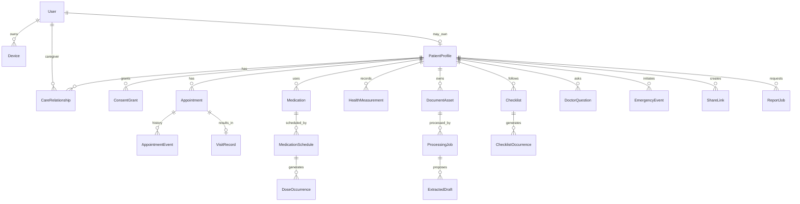

# 03 — Database Design

> **Source:** `mo-nut-SRS-two-phase.md` เวอร์ชัน 1.0, วันที่ 24 มิถุนายน 2026. เอกสารนี้ต้องอ่านร่วมกับไฟล์อื่นใน `docs/design/`

## 1. Data model principles

- Canonical entities are independent from Firestore/PostgreSQL/MongoDB
- UUID/ULID IDs, explicit relationships and schema versioning
- UTC timestamps with explicit local time zone where scheduling matters
- Immutable event/history records; no silent overwrite
- Avoid unbounded arrays and deeply nested documents
- Denormalized read models are rebuildable and not source of truth
- Public API never exposes Firebase-specific types

## 2. Domain overview

## 3. Canonical entity catalog

| Entity | Purpose | Important fields |
|---|---|---|
| `User` | บัญชีและสถานะผู้ใช้ | `id`, `identityRefs`, `roles`, `locale`, `status` |
| `Device` | อุปกรณ์และ Push Token | `id`, `userId`, `platform`, `appVersion`, `pushTokenRef`, `lastSeenAt` |
| `PatientProfile` | ข้อมูลผู้ป่วย | `id`, `ownerUserId`, `demographics`, `conditions`, `allergies`, `emergencySettings` |
| `CareRelationship` | ความสัมพันธ์ผู้ป่วย-ผู้ดูแล | `id`, `patientId`, `caregiverUserId`, `role`, `status` |
| `ConsentGrant` | หลักฐาน Consent | `id`, `patientId`, `granteeId`, `purposes`, `scopes`, `policyVersion`, `validFrom`, `expiresAt`, `revokedAt` |
| `PermissionGrant` | สิทธิ์เชิงปฏิบัติ | `id`, `subjectId`, `resourceOwnerId`, `scopes`, `constraints` |
| `HealthcareFacility` | สถานพยาบาล | `id`, `name`, `address`, `geo`, `contact` |
| `ProviderProfile` | แพทย์/บุคลากร | `id`, `userId`, `organizationId`, `profession`, `verificationStatus` |
| `Appointment` | นัดหมาย | `id`, `patientId`, `facilityId`, `providerId`, `scheduledAt`, `timezone`, `status`, `revision` |
| `AppointmentEvent` | ประวัติสถานะนัด | `id`, `appointmentId`, `type`, `oldValue`, `newValue`, `actorId`, `occurredAt` |
| `VisitRecord` | เหตุการณ์พบแพทย์ | `id`, `appointmentId`, `patientId`, `summary`, `completedAt` |
| `Medication` | รายการยา | `id`, `patientId`, `names`, `strength`, `form`, `images`, `source`, `status` |
| `MedicationSchedule` | กติกาตารางยา | `id`, `medicationId`, `rule`, `effectiveFrom`, `effectiveTo`, `timezone`, `version` |
| `DoseOccurrence` | รอบยาที่เกิดขึ้น | `id`, `scheduleId`, `patientId`, `dueAt`, `status`, `respondedAt`, `actorId` |
| `MedicationInventory` | ยาคงเหลือ | `id`, `medicationId`, `quantity`, `unit`, `estimatedAt` |
| `HealthMeasurement` | ค่าข้อมูลสุขภาพ | `id`, `patientId`, `type`, `value`, `unit`, `measuredAt`, `context`, `source` |
| `SymptomEntry` | อาการ/ผลข้างเคียง | `id`, `patientId`, `severity`, `description`, `occurredAt`, `relatedMedicationIds` |
| `DocumentAsset` | เอกสารและไฟล์ | `id`, `patientId`, `objectKey`, `mimeType`, `category`, `checksum`, `status` |
| `ProcessingJob` | งาน OCR/STT/AI | `id`, `assetId`, `jobType`, `provider`, `modelVersion`, `status`, `resultRef` |
| `ExtractedDraft` | ข้อมูลเสนอจาก AI | `id`, `jobId`, `targetType`, `payload`, `confidence`, `reviewStatus` |
| `AudioRecord` | ไฟล์เสียง | `id`, `patientId`, `visitId`, `assetId`, `consentConfirmedAt` |
| `Transcript` | ข้อความเสียง | `id`, `audioId`, `text`, `segments`, `language`, `reviewedAt` |
| `Checklist` | ชุดคำแนะนำ | `id`, `patientId`, `sourceType`, `sourceId`, `title`, `targetRule`, `status` |
| `ChecklistOccurrence` | รายการที่ต้องทำ | `id`, `checklistId`, `dueAt`, `status`, `completedAt`, `actorId` |
| `DoctorQuestion` | คำถามแพทย์ | `id`, `patientId`, `appointmentId`, `priority`, `status`, `answer` |
| `NotificationRule` | กฎแจ้งเตือน | `id`, `ownerId`, `eventType`, `channels`, `offsets`, `escalation` |
| `NotificationDelivery` | ประวัติส่งแจ้งเตือน | `id`, `ruleId`, `recipientId`, `channel`, `status`, `providerMessageId` |
| `EmergencyEvent` | เหตุการณ์ SOS | `id`, `patientId`, `initiatedAt`, `status`, `locationRef`, `closedAt` |
| `ShareLink` | ลิงก์แชร์ | `id`, `ownerId`, `tokenHash`, `scopes`, `expiresAt`, `revokedAt` |
| `ReportJob` | งานสร้างรายงาน | `id`, `patientId`, `period`, `scopes`, `status`, `assetId` |
| `AuditEvent` | เหตุการณ์ตรวจสอบ | `id`, `actorId`, `action`, `resourceType`, `resourceId`, `purpose`, `occurredAt`, `correlationId` |
| `SyncOperation` | คำสั่ง Offline | `id`, `userId`, `entityType`, `operation`, `idempotencyKey`, `status`, `baseVersion` |
| `Organization` | องค์กร/โครงการ | `id`, `name`, `type`, `status`, `settings` |
| `ContentArticle` | บทความสุขภาพ | `id`, `version`, `status`, `reviewerId`, `references`, `publishedAt` |

## 4. Common fields

Every mutable canonical entity should use the applicable fields:

| Field | Type | Rule |
|---|---|---|
| id | UUID/ULID string | database-independent |
| schemaVersion | integer | required for migration |
| version | integer | optimistic concurrency |
| status | enum | shared contract |
| createdAt/updatedAt | UTC timestamp | server authoritative |
| createdBy/updatedBy | actor ID | service account allowed |
| deletedAt | UTC timestamp/null | only where soft-delete policy applies |
| source | enum/object | manual, OCR, STT, import, device |

## 5. Key enums/state

- Appointment: `upcoming`, `confirmed`, `traveling`, `arrived`, `waiting`, `completed`, `rescheduled`, `cancelled`, `missed`
- Dose: `scheduled`, `due`, `snoozed`, `taken`, `skipped`, `issue_reported`, `missed`
- Processing job: `uploaded`, `queued`, `processing`, `review_required`, `confirmed`, `applied`, `failed`, `retrying`, `manual_entry`
- Consent/share: `draft`, `active`, `suspended`, `revoked`, `expired`
- Sync: `pending`, `syncing`, `synced`, `failed`, `retrying`, `conflict`, `resolved`

## 6. Relationships and constraints

- `PatientProfile.ownerUserId` must point to an authorized owner/representative
- `CareRelationship` unique active pair by patient/caregiver/role
- `ConsentGrant` is versioned evidence; revocation does not delete history
- `MedicationSchedule` uses effective period; prior dose occurrences are immutable except audited correction
- `DoseOccurrence` unique by deterministic occurrence key/schedule/version/due time
- `HealthMeasurement` is append-oriented and stores unit/context/source
- `ShareLink` stores token hash only; plaintext token is never persisted
- `AuditEvent` cannot be edited through normal application API
- Any resource with `patientId` must be authorized against that patient, not only actor role

## 7. Firestore physical mapping (initial)

| Collection | Source entity | Index/query notes |
|---|---|---|
| users | User | identity refs, status |
| devices | Device | userId + lastSeenAt; token restricted |
| patients | PatientProfile | ownerUserId, status |
| care_relationships | CareRelationship | patientId and caregiverUserId indexes |
| consent_grants | ConsentGrant | patientId/granteeId/status/expiry |
| permission_grants | PermissionGrant | subject/resourceOwner/scope |
| appointments | Appointment | patientId + scheduledAt + status |
| appointment_events | AppointmentEvent | appointmentId + occurredAt |
| medications | Medication | patientId + status |
| medication_schedules | MedicationSchedule | medicationId + effective period |
| dose_occurrences | DoseOccurrence | patientId + dueAt + status; high-volume partition review |
| health_measurements | HealthMeasurement | patientId + type + measuredAt |
| document_assets | DocumentAsset | patientId + category + status |
| processing_jobs | ProcessingJob | status + createdAt for worker queue |
| checklists | Checklist | patientId + status |
| checklist_occurrences | ChecklistOccurrence | patientId/checklistId + dueAt |
| notification_deliveries | NotificationDelivery | recipientId + createdAt; TTL/archive |
| audit_events | AuditEvent | resource/actor/occurredAt; server write only |
| sync_operations | SyncOperation | userId + idempotencyKey unique behavior |

## 8. Index strategy

Indexes must be driven by approved API queries. Minimum candidates:

- appointments: `(patientId, scheduledAt desc)`, `(patientId, status, scheduledAt)`
- doses: `(patientId, dueAt)`, `(patientId, status, dueAt)`
- measurements: `(patientId, type, measuredAt desc)`
- caregiver relation: `(caregiverUserId, status)`, `(patientId, status)`
- consent: `(patientId, granteeId, status)`, expiry job index
- processing jobs: `(status, createdAt)`
- notification delivery: `(recipientId, createdAt desc)`, `(status, nextRetryAt)`

Do not create broad indexes containing sensitive fields without query and cost review.

## 9. Audit and history

Audit must include actor, action, resource, purpose, timestamp, correlation ID, source device/application and before/after reference where allowed. Required events include login security events, consent grant/revoke, caregiver access, share link use, appointment/medication changes, admin/support access, report export and SOS.

## 10. Soft delete, retention and legal hold

- User-facing deletion first marks/tombstones data where recovery/legal checks apply
- Binary assets follow category-specific retention and object lifecycle rules
- Temporary unconfirmed OCR/STT assets are deleted by policy
- Notification delivery has shorter TTL than clinical history
- Audit/security records may outlive account deletion with minimization/pseudonymization
- Legal hold overrides ordinary deletion and is itself audited

Retention periods are Open Decisions and must be documented before production.

## 11. Migration and seed

- Seed only synthetic facilities/content/reference data
- Never seed real PII/PHI into dev/test
- Export canonical JSON/NDJSON with schemaVersion
- Validate counts, references, hashes and sampled records
- Use shadow-read/dual-read in staging; controlled dual-write only when necessary
- Cut over by feature flag with rollback and observation window

## 12. Backup and restore

- Define RPO/RTO per data class before production
- Back up database metadata and object storage consistently
- Perform restore drills in isolated environment
- Validate audit/event continuity and object references after restore
- Encrypt backups and restrict restore permission

## 13. Privacy notes

- Classify profile/contact as PII and health/medication/document/transcript as PHI-sensitive
- Minimize fields and local cache
- Signed URLs are short-lived and scope-bound
- Do not store raw provider prompt/response containing unnecessary PHI
- Analytics must use pseudonymous identifiers and no free-text clinical content

## 14. Physical models for future stores

### PostgreSQL

Use normalized source-of-truth tables, foreign keys, partial indexes, row/version columns and append-only event/audit tables. JSONB may hold provider payload only behind canonical mapping.

### MongoDB

Use bounded documents and explicit references for high-growth histories. Avoid embedding unbounded dose/measurement/event arrays. Apply schema validation and unique compound indexes.
