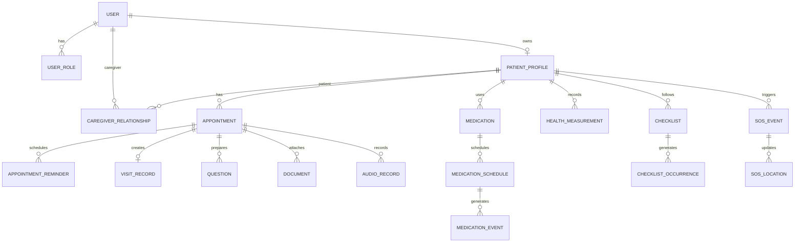

# 03 — Database Design

**Source:** SRS Sections 12–15 และ database portability requirements

## Design Goals

- ใช้ Firestore ใน MVP
- ย้ายไป PostgreSQL หรือ MongoDB ได้โดยไม่เปลี่ยน domain/API หลัก
- รองรับ patient ownership, caregiver permissions, audit และ offline sync
- ป้องกัน unbounded documents และ provider-specific types

## Standard Fields

ทุก entity ต้องมีอย่างน้อย:

```json
{
  "id": "01J...",
  "schemaVersion": 1,
  "createdAt": "2026-06-23T08:00:00Z",
  "createdBy": "usr_...",
  "updatedAt": "2026-06-23T08:00:00Z",
  "updatedBy": "usr_...",
  "deletedAt": null,
  "version": 1
}
```

- `id`: UUIDv7 หรือ ULID
- `version`: optimistic concurrency
- `deletedAt`: soft delete เมื่อ entity มีความสำคัญทางสุขภาพ/กฎหมาย

## Core Collections

```text
users
user_roles
patient_profiles
organizations
organization_members
caregiver_invitations
caregiver_relationships
consents
medical_conditions
allergies
emergency_contacts
emergency_profiles
appointments
appointment_reminders
visit_records
documents
document_extractions
audio_records
audio_transcripts
medications
medication_schedules
medication_events
medication_inventory_events
health_measurements
checklists
checklist_occurrences
questions
question_answers
sos_events
sos_locations
notification_preferences
notification_jobs
notification_deliveries
reports
share_links
audit_logs
outbox_events
```

## Conceptual ERD



## Entity Summary

### users

| Field | Type | Required | Notes |
|---|---|---:|---|
| id | string | yes | Domain ID |
| firebaseUid | string | yes | unique external identity |
| email | string/null | no | normalized |
| phone | string/null | no | E.164 |
| displayName | string | yes | ไม่ควรใช้เป็น lookup key |
| locale | string | yes | default `th-TH` |
| timezone | string | yes | default `Asia/Bangkok` |
| status | enum | yes | ACTIVE/SUSPENDED/DELETED |

Index: `firebaseUid unique`, `phone`, `email`

### patient_profiles

| Field | Type | Required |
|---|---|---:|
| id | string | yes |
| ownerUserId | string | yes |
| firstName | string | yes |
| lastName | string | yes |
| dateOfBirth | date/null | no |
| sex | enum/null | no |
| bloodType | enum/null | no |
| preferredFontScale | number | yes |

Index: `ownerUserId unique`

### caregiver_relationships

| Field | Type | Required | Notes |
|---|---|---:|---|
| patientId | string | yes | FK-like ID |
| caregiverUserId | string | yes | FK-like ID |
| relationshipType | enum | yes | FAMILY/PROFESSIONAL/OTHER |
| status | enum | yes | PENDING/ACTIVE/REVOKED/EXPIRED |
| isPrimary | boolean | yes | only one active primary per patient |
| permissions | string[] | yes | bounded list |
| expiresAt | timestamp/null | no | optional |

Unique logical constraint: `(patientId, caregiverUserId, active)`

### appointments

| Field | Type | Required |
|---|---|---:|
| patientId | string | yes |
| organizationId | string/null | no |
| doctorId | string/null | no |
| scheduledStartAt | timestamp | yes |
| scheduledEndAt | timestamp/null | no |
| timezone | string | yes |
| status | enum | yes |
| hospitalName | string | yes |
| department | string | yes |
| building/floor/room | string/null | no |
| latitude/longitude | number/null | no |
| preparationNotes | string/null | no |
| source | enum | yes |

Indexes:

- `patientId + scheduledStartAt desc`
- `patientId + status + scheduledStartAt`
- `organizationId + scheduledStartAt`

### medications

| Field | Type | Required |
|---|---|---:|
| patientId | string | yes |
| name | string | yes |
| genericName | string/null | no |
| strengthValue | number/null | no |
| strengthUnit | string/null | no |
| form | enum/null | no |
| imageDocumentId | string/null | no |
| startDate | date | yes |
| endDate | date/null | no |
| status | enum | yes |
| source | enum | yes |

Index: `patientId + status`

### medication_schedules

| Field | Type | Required |
|---|---|---:|
| medicationId | string | yes |
| patientId | string | yes |
| scheduleType | enum | yes |
| times | string[] | conditional |
| weekdays | int[] | conditional |
| intervalHours | number | conditional |
| timezone | string | yes |
| doseQuantity | number | yes |
| doseUnit | string | yes |
| mealRelation | enum/null | no |
| effectiveFrom | date | yes |
| effectiveUntil | date/null | no |
| status | enum | yes |

Portability: PostgreSQL แยก `times` และ `weekdays` เป็น child tables; repository adapter map กลับ domain object

### medication_events

Append-oriented; ไม่แก้ประวัติ schedule เดิม

| Field | Type | Required |
|---|---|---:|
| patientId | string | yes |
| medicationId | string | yes |
| scheduleId | string | yes |
| occurrenceKey | string | yes |
| scheduledAt | timestamp | yes |
| status | enum | yes |
| actionAt | timestamp/null | no |
| recordedByUserId | string/null | no |
| skipReason | string/null | no |
| source | enum | yes |

Unique logical constraint: `occurrenceKey`

Indexes:

- `patientId + scheduledAt desc`
- `patientId + status + scheduledAt`
- `scheduleId + scheduledAt`

### health_measurements

| Field | Type | Required |
|---|---|---:|
| patientId | string | yes |
| measurementType | enum | yes |
| measuredAt | timestamp | yes |
| values | object | yes |
| unit | string/object | yes |
| context | enum/null | no |
| source | enum | yes |
| recordedByUserId | string | yes |

Index: `patientId + measurementType + measuredAt desc`

`values` ใช้ flexible object ใน Firestore/MongoDB; เมื่อย้าย PostgreSQL ให้ใช้ JSONB หรือ normalized projection สำหรับ analytics

### documents

| Field | Type | Required |
|---|---|---:|
| patientId | string | yes |
| appointmentId | string/null | no |
| category | enum | yes |
| storageObjectKey | string | yes |
| mimeType | string | yes |
| sizeBytes | number | yes |
| checksum | string | yes |
| status | enum | yes |

ห้ามเก็บ signed URL ถาวร; สร้างเมื่อมี authorized request

### checklists / checklist_occurrences

Checklist เก็บ template และ goal; occurrence เก็บผลรายวัน/รอบ

Index: `patientId + status`, `checklistId + dueAt`, `patientId + dueAt`

### questions / question_answers

คำถามผูก appointment; คำตอบแยก entity เพื่อรองรับ text/audio/source/audit

### sos_events / sos_locations

- `sos_events` เก็บ lifecycle CREATED/ACTIVE/RESOLVED/CANCELLED
- `sos_locations` เป็น append-only updates และมี retention สั้นตาม policy

### reports / share_links

- Report generation async
- Share token เก็บเฉพาะ hash
- `expiresAt`, `revokedAt`, `maxViews` และ access audit

### audit_logs

Append-only; ห้าม client เขียนโดยตรง

Index: `patientId + occurredAt`, `actorUserId + occurredAt`, `resourceType + resourceId + occurredAt`

### outbox_events

| Field | Notes |
|---|---|
| eventType | stable event name |
| aggregateId | resource ID |
| payload | minimal required data |
| status | PENDING/PROCESSING/PUBLISHED/FAILED |
| attemptCount | retry |
| nextAttemptAt | scheduling |

## Status and Enum Baseline

- Appointment: UPCOMING, CONFIRMED, TRAVELING, ARRIVED, WAITING, COMPLETED, RESCHEDULED, CANCELLED, MISSED
- Medication: ACTIVE, STOPPED, COMPLETED
- Medication Event: SCHEDULED, TAKEN, SNOOZED, SKIPPED, NOT_TAKEN, UNKNOWN
- OCR/STT: UPLOADED, PROCESSING, REVIEW_REQUIRED, CONFIRMED, FAILED
- Checklist: DRAFT, ACTIVE, PAUSED, COMPLETED, CANCELLED
- SOS: CREATED, ACTIVE, RESOLVED, CANCELLED, FAILED

## Firestore Rules of Thumb

- ใช้ top-level collections
- Query ด้วย explicit patientId/organizationId
- ไม่ใช้ arrays ขนาดใหญ่สำหรับ event history
- Transaction สำหรับ invitation accept, medication confirm, primary caregiver และ share revoke
- Composite indexes เก็บใน version control

## Retention and Deletion

- Account deletion เป็น staged deletion ตามกฎหมายและข้อผูกพัน
- Medical history ใช้ soft delete และ audit
- Raw audio/AI input มี configurable retention
- SOS location มี short retention เว้นแต่ผู้ใช้ยินยอมเก็บ
- Audit logs มี retention แยกและ append-only

## Migration Strategy

1. Export NDJSON พร้อม schemaVersion/checksum
2. Backfill target database
3. Validate counts, IDs, timestamps และ relationships
4. Dual-write ผ่าน repository facade
5. Compare reads
6. Switch read source
7. Disable Firestore writes
8. Archive/read-only ตาม policy

## Backup and Restore

- Automated Firestore export ตาม environment policy
- Storage lifecycle/versioning ตามความสำคัญ
- Quarterly restore drill สำหรับ production เมื่อเปิดให้บริการจริง
- Backup ต้องเข้ารหัสและจำกัดสิทธิ์

## Open Questions

- Retention duration ราย entity
- ต้องรองรับ national patient identifier หรือไม่
- ใช้ PostgreSQL analytics replica ตั้งแต่ Pilot หรือรอ Scale
- ขนาดข้อมูลเสียงและ quota ต่อ plan
