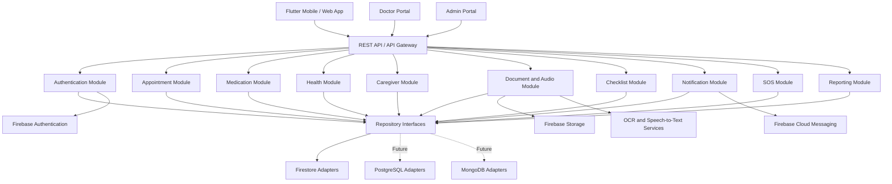
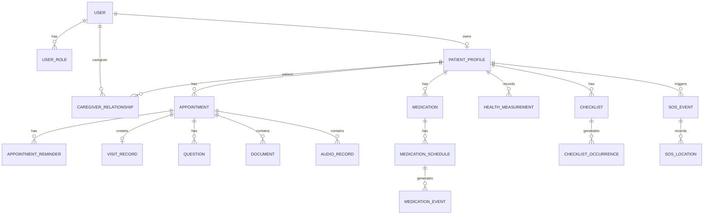
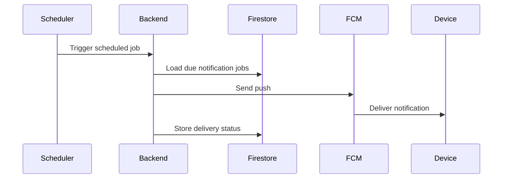

# SOFTWARE REQUIREMENTS SPECIFICATION

# หมอนัด — Mo-nut

**ระบบช่วยจัดการนัดหมาย การใช้ยา และการดูแลผู้ป่วยโรคเรื้อรัง**

---

## ข้อมูลเอกสาร

| รายการ                   | รายละเอียด                                              |
| ------------------------ | ------------------------------------------------------- |
| ชื่อระบบ                 | หมอนัด                                                  |
| ชื่อภาษาอังกฤษ           | Mo-nut                                                  |
| ประเภทเอกสาร             | Software Requirements Specification                     |
| เวอร์ชัน                 | 1.0                                                     |
| สถานะ                    | Initial Development Baseline                            |
| เอกสารอ้างอิง            | Product Requirements Document: Mo-nut Version 1.0       |
| แพลตฟอร์ม                | Android, iOS, Web และ PWA                               |
| Backend Platform         | Firebase และ Google Cloud                               |
| ฐานข้อมูลเริ่มต้น        | Cloud Firestore                                         |
| เป้าหมายฐานข้อมูลในอนาคต | PostgreSQL หรือ MongoDB                                 |
| รูปแบบสถาปัตยกรรม        | API-first, Modular Monolith, Clean Architecture         |
| กลุ่มผู้ใช้งาน           | ผู้ป่วย ผู้ดูแล แพทย์ บุคลากรทางการแพทย์ และผู้ดูแลระบบ |

---

# 1. วัตถุประสงค์ของเอกสาร

เอกสารนี้กำหนดข้อกำหนดเชิงระบบของแอปพลิเคชันหมอนัด หรือ Mo-nut เพื่อใช้เป็นแนวทางร่วมกันสำหรับ

* Product Owner
* Business Analyst
* UX/UI Designer
* Mobile Developer
* Web Developer
* Backend Developer
* QA Engineer
* DevOps Engineer
* Security Engineer
* Data Engineer
* ทีมดูแลระบบ
* ลูกค้าและพันธมิตรสถานพยาบาล

เอกสารครอบคลุม

1. สถาปัตยกรรมระบบ
2. เทคโนโลยีที่แนะนำ
3. Functional Requirements
4. Non-functional Requirements
5. Data Model
6. API Contract
7. Security และ Privacy
8. Offline และ Data Synchronization
9. Notification
10. OCR, Speech-to-Text และ AI
11. การทดสอบ
12. การ Deploy
13. การเตรียมย้ายฐานข้อมูล
14. แนวทางให้ Frontend และ Backend ทำงานขนานกัน

---

# 2. ขอบเขตระบบ

Mo-nut เป็นระบบสำหรับช่วยผู้ป่วยโรคเรื้อรังจัดการ

* นัดหมายกับแพทย์
* ใบนัดและเอกสารทางการแพทย์
* รายการยาและตารางกินยา
* การแจ้งเตือนกินยา
* ข้อมูลสุขภาพ
* บันทึกเสียงคำแนะนำ
* เช็กลิสต์คำแนะนำจากแพทย์
* คำถามเตรียมไปพบแพทย์
* การแชร์ข้อมูลให้ผู้ดูแล
* แผนที่และการเดินทาง
* ปุ่ม SOS
* รายงานสุขภาพ

ระบบต้องรองรับการใช้งานบน

* Android
* iPhone
* Tablet
* Web Browser
* Progressive Web App
* Desktop Portal สำหรับแพทย์และผู้ดูแลระบบ

---

# 3. คำศัพท์และคำย่อ

| คำศัพท์             | ความหมาย                                      |
| ------------------- | --------------------------------------------- |
| Patient             | ผู้ป่วยและเจ้าของข้อมูลสุขภาพ                 |
| Caregiver           | ผู้ดูแลหรือสมาชิกครอบครัว                     |
| Doctor              | แพทย์หรือบุคลากรทางการแพทย์                   |
| Admin               | ผู้ดูแลระบบ                                   |
| Appointment         | นัดหมาย                                       |
| Medication          | รายการยา                                      |
| Medication Schedule | กำหนดเวลารับประทานยา                          |
| Medication Event    | เหตุการณ์กินยา ข้ามยา หรือพลาดยา              |
| Health Measurement  | ค่าสุขภาพ เช่น ความดัน น้ำหนัก น้ำตาล         |
| Checklist           | รายการคำแนะนำหรือกิจกรรมที่ต้องทำ             |
| OCR                 | การอ่านข้อความจากรูปภาพ                       |
| STT                 | Speech-to-Text หรือการแปลงเสียงเป็นข้อความ    |
| FCM                 | Firebase Cloud Messaging                      |
| RBAC                | Role-based Access Control                     |
| API                 | Application Programming Interface             |
| DTO                 | Data Transfer Object                          |
| Repository          | ส่วนเชื่อมระหว่าง Business Logic กับฐานข้อมูล |
| PWA                 | Progressive Web App                           |
| PDPA                | กฎหมายคุ้มครองข้อมูลส่วนบุคคล                 |
| PHI                 | ข้อมูลสุขภาพที่สามารถระบุตัวบุคคลได้          |
| MVP                 | Minimum Viable Product                        |

---

# 4. เป้าหมายทางเทคนิค

ระบบต้องได้รับการออกแบบให้บรรลุเป้าหมายดังต่อไปนี้

1. รองรับ Android, iOS และ Web
2. ใช้ Codebase ร่วมกันให้มากที่สุด
3. ใช้ Firebase เป็นโครงสร้างพื้นฐานเริ่มต้น
4. ไม่ผูก Business Logic เข้ากับ Firestore โดยตรง
5. รองรับการย้ายไป PostgreSQL หรือ MongoDB
6. Frontend และ Backend ต้องพัฒนาแยกกันได้
7. รองรับ Offline-first สำหรับฟังก์ชันสำคัญ
8. รองรับผู้ใช้งานจำนวนมาก
9. มีมาตรการรักษาความปลอดภัยสำหรับข้อมูลสุขภาพ
10. รองรับการเพิ่มโรงพยาบาลหรือองค์กรในอนาคต
11. รองรับการเชื่อมต่อระบบภายนอกผ่าน API
12. รองรับการเพิ่มภาษาในอนาคต

---

# 5. สถาปัตยกรรมที่แนะนำ

## 5.1 Technology Stack

### Client Application

แนะนำให้ใช้

* Flutter
* Dart
* Riverpod หรือ Bloc สำหรับ State Management
* GoRouter สำหรับ Navigation
* Dio สำหรับ HTTP Client
* Freezed และ json_serializable สำหรับ Model
* Drift หรือ SQLite สำหรับ Local Database
* Firebase SDK สำหรับ Authentication, Messaging และ Crashlytics

Flutter จะใช้เป็น Codebase หลักสำหรับ

* Android
* iOS
* Tablet
* Web
* PWA

### Doctor และ Admin Portal

สามารถเริ่มด้วย Flutter Web เพื่อใช้ Codebase ร่วมกัน หรือใช้ Next.js ในกรณีที่ Portal มีตาราง รายงาน และฟังก์ชันบริหารจัดการจำนวนมาก

ข้อเสนอสำหรับ MVP:

* Patient และ Caregiver App: Flutter
* Doctor Lite Portal: Flutter Web
* Admin Portal: Next.js หรือ Flutter Web
* Backend API: TypeScript

### Backend

แนะนำให้ใช้

* Node.js
* TypeScript
* NestJS
* Firebase Functions Generation 2 หรือ Cloud Run
* OpenAPI 3.1
* Zod หรือ class-validator
* Firebase Admin SDK
* Repository Pattern
* Dependency Injection

### Firebase Services

* Firebase Authentication
* Cloud Firestore
* Firebase Cloud Storage
* Firebase Cloud Messaging
* Firebase App Check
* Firebase Hosting
* Firebase Analytics
* Firebase Crashlytics
* Firebase Remote Config
* Firebase Emulator Suite
* Cloud Functions for Firebase
* Scheduled Functions

### Google Cloud Services ที่อาจใช้ร่วมกัน

* Cloud Run
* Cloud Tasks
* Cloud Scheduler
* Pub/Sub
* Secret Manager
* Cloud Logging
* Cloud Monitoring
* Speech-to-Text
* Document AI หรือ Vision API
* Maps Platform

---

## 5.2 Architecture Diagram



---

## 5.3 Architectural Principles

ระบบต้องใช้หลักการดังต่อไปนี้

### API-first

Frontend ต้องเรียกข้อมูลผ่าน Backend API สำหรับข้อมูลสำคัญ ไม่ควรเขียนหรือแก้ไข Firestore โดยตรง ยกเว้นกรณีที่ได้รับการออกแบบและประเมินความปลอดภัยไว้แล้ว

### Clean Architecture

ระบบ Backend แบ่งเป็น

1. Presentation Layer
2. Application Layer
3. Domain Layer
4. Infrastructure Layer

Domain Layer ต้องไม่ import Firebase SDK

### Repository Pattern

Business Logic ต้องเรียกข้อมูลผ่าน Interface เช่น

```typescript
interface AppointmentRepository {
  findById(id: string): Promise<Appointment | null>;
  findByPatientId(patientId: string): Promise<Appointment[]>;
  create(appointment: Appointment): Promise<Appointment>;
  update(appointment: Appointment): Promise<Appointment>;
  delete(id: string): Promise<void>;
}
```

Firestore, PostgreSQL และ MongoDB ต้องสามารถสร้าง Adapter ตาม Interface เดียวกันได้

### Dependency Injection

Repository และ External Service ต้องถูก Inject เข้าสู่ Use Case เพื่อให้เปลี่ยน Implementation ได้โดยไม่เปลี่ยน Business Logic

### Contract-first

API Contract ต้องถูกกำหนดก่อนเริ่มพัฒนา Frontend และ Backend

### No Vendor-specific Domain Model

Domain Object ต้องไม่มี

* DocumentReference
* GeoPoint ของ Firestore
* Timestamp ของ Firebase
* FieldValue
* Firestore Snapshot
* Firebase User Object

ให้แปลงค่าดังกล่าวใน Infrastructure Layer เท่านั้น

---

# 6. โครงสร้างโครงการ

แนะนำให้ใช้ Monorepo

```text
mo-nut/
├── apps/
│   ├── mobile/
│   ├── web/
│   ├── doctor-portal/
│   ├── admin-portal/
│   └── backend/
├── packages/
│   ├── api-contract/
│   ├── domain-models/
│   ├── design-system/
│   ├── localization/
│   ├── test-fixtures/
│   └── shared-utils/
├── infrastructure/
│   ├── firebase/
│   ├── terraform/
│   ├── scripts/
│   └── monitoring/
├── docs/
│   ├── prd/
│   ├── srs/
│   ├── api/
│   ├── architecture/
│   └── decisions/
└── .github/
    └── workflows/
```

หากทีม Flutter และ Backend ใช้ Repository แยกกัน ให้มี Repository กลางสำหรับ

* OpenAPI Specification
* JSON Schema
* API Version
* Mock Data
* Error Codes
* Changelog

---

# 7. บทบาทและสิทธิ์

## 7.1 Roles

ระบบต้องรองรับ Role ต่อไปนี้

| Role               | คำอธิบาย                    |
| ------------------ | --------------------------- |
| PATIENT            | ผู้ป่วย                     |
| CAREGIVER          | ผู้ดูแล                     |
| DOCTOR             | แพทย์หรือบุคลากรทางการแพทย์ |
| ORGANIZATION_ADMIN | ผู้ดูแลสถานพยาบาล           |
| SYSTEM_ADMIN       | ผู้ดูแลระบบส่วนกลาง         |
| SUPPORT            | เจ้าหน้าที่ช่วยเหลือ        |
| AUDITOR            | ผู้ตรวจสอบประวัติการเข้าถึง |

ผู้ใช้หนึ่งคนสามารถมีหลาย Role ได้

---

## 7.2 Permission Model

สิทธิ์ต้องพิจารณาจาก

* Role
* ความเป็นเจ้าของข้อมูล
* Caregiver Relationship
* Organization Membership
* Consent
* Permission Scope
* วันหมดอายุของสิทธิ์
* สถานะบัญชี

ตัวอย่าง Permission Scope

* `appointment.read`
* `appointment.write`
* `medication.read`
* `medication.write`
* `health.read`
* `health.write`
* `document.read`
* `audio.read`
* `checklist.read`
* `checklist.write`
* `report.download`
* `sos.receive`

---

# 8. Functional Requirements

# 8.1 Authentication และ Account

### FR-AUTH-001

ระบบต้องให้ผู้ใช้สมัครด้วยหมายเลขโทรศัพท์และ OTP ได้

### FR-AUTH-002

ระบบต้องให้ผู้ใช้สมัครและเข้าสู่ระบบด้วยอีเมลได้

### FR-AUTH-003

ระบบต้องรองรับ Google Sign-In

### FR-AUTH-004

ระบบต้องรองรับ Sign in with Apple บน iOS

### FR-AUTH-005

ระบบต้องให้ผู้ใช้ตั้ง PIN สำหรับเข้าแอปได้

### FR-AUTH-006

ระบบต้องรองรับ Fingerprint, Touch ID หรือ Face ID

### FR-AUTH-007

ระบบต้องรองรับการออกจากระบบทุกอุปกรณ์

### FR-AUTH-008

ระบบต้องบันทึกอุปกรณ์ที่เข้าสู่ระบบล่าสุด

### FR-AUTH-009

ระบบต้องให้ผู้ใช้ลบบัญชีได้

### FR-AUTH-010

ระบบต้องยกเลิก Refresh Token และ Session เมื่อบัญชีถูกระงับหรือลบ

---

# 8.2 โปรไฟล์ผู้ป่วย

### FR-PAT-001

ผู้ใช้ต้องสามารถสร้าง Patient Profile ได้

### FR-PAT-002

Patient Profile ต้องรองรับข้อมูล

* ชื่อ
* นามสกุล
* วันเกิด
* เพศ
* กรุ๊ปเลือด
* รูปภาพ
* เบอร์โทรศัพท์
* ที่อยู่โดยประมาณ
* ภาษา
* ขนาดตัวอักษร

### FR-PAT-003

ระบบต้องให้ผู้ป่วยบันทึกโรคประจำตัวได้หลายรายการ

### FR-PAT-004

ระบบต้องให้ผู้ป่วยบันทึกประวัติแพ้ยาและแพ้อาหารได้

### FR-PAT-005

ผู้ป่วยต้องสามารถเพิ่มโรงพยาบาลและหมายเลข HN ได้หลายแห่ง

### FR-PAT-006

ผู้ป่วยต้องสามารถกำหนดผู้ติดต่อฉุกเฉินได้หลายคน

### FR-PAT-007

ผู้ป่วยต้องกำหนดลำดับผู้ติดต่อฉุกเฉินได้

---

# 8.3 Caregiver Management

### FR-CARE-001

ผู้ป่วยต้องสามารถเชิญผู้ดูแลผ่าน

* เบอร์โทรศัพท์
* อีเมล
* QR Code
* Invitation Link

### FR-CARE-002

Invitation Link ต้องมีวันหมดอายุ

### FR-CARE-003

ผู้ป่วยต้องกำหนดสิทธิ์ของผู้ดูแลแยกตามหมวดได้

### FR-CARE-004

ผู้ป่วยต้องสามารถยกเลิกสิทธิ์ได้ทันที

### FR-CARE-005

ผู้ป่วยต้องสามารถกำหนดผู้ดูแลหลักและผู้ดูแลสำรองได้

### FR-CARE-006

ผู้ดูแลหนึ่งคนต้องสามารถดูแลผู้ป่วยหลายคนได้

### FR-CARE-007

ระบบต้องบันทึกประวัติการเพิ่ม เปลี่ยน หรือยกเลิกสิทธิ์

### FR-CARE-008

ผู้ดูแลต้องไม่สามารถเข้าถึงข้อมูลที่ไม่ได้รับสิทธิ์

---

# 8.4 Appointment Management

### FR-APT-001

ผู้ใช้ต้องสามารถสร้างนัดหมายด้วยตนเองได้

### FR-APT-002

นัดหมายต้องมีข้อมูลอย่างน้อย

* วัน
* เวลา
* สถานพยาบาล
* แผนก
* สถานะ

### FR-APT-003

ระบบต้องรองรับข้อมูลเพิ่มเติม

* ชื่อแพทย์
* อาคาร
* ชั้น
* ห้องตรวจ
* จุดลงทะเบียน
* หมายเหตุ
* เอกสารที่ต้องเตรียม
* การงดน้ำหรืออาหาร

### FR-APT-004

ผู้ใช้ต้องสามารถแก้ไข เลื่อน หรือยกเลิกนัดได้

### FR-APT-005

ระบบต้องเก็บประวัติการเปลี่ยนแปลงนัดหมาย

### FR-APT-006

ผู้ใช้ต้องสามารถเพิ่มนัดหมายลง Calendar ของอุปกรณ์ได้

### FR-APT-007

ระบบต้องรองรับสถานะ

* UPCOMING
* CONFIRMED
* TRAVELING
* ARRIVED
* WAITING
* COMPLETED
* RESCHEDULED
* CANCELLED
* MISSED

### FR-APT-008

ผู้ป่วยต้องสามารถระบุผู้ดูแลที่รับผิดชอบการเดินทางได้

### FR-APT-009

ผู้ป่วยต้องสามารถเชื่อมเอกสาร คำถาม บันทึกเสียง ผลตรวจ และเช็กลิสต์กับนัดหมายได้

---

# 8.5 Appointment OCR

### FR-OCR-001

ผู้ใช้ต้องสามารถถ่ายรูปหรืออัปโหลดใบนัดได้

### FR-OCR-002

ระบบต้องเก็บรูปต้นฉบับใน Cloud Storage

### FR-OCR-003

ระบบต้องสามารถตรวจจับ

* วันที่
* เวลา
* สถานพยาบาล
* แผนก
* แพทย์
* ห้องตรวจ

### FR-OCR-004

ระบบต้องแสดงข้อมูลที่ตรวจจับได้ให้ผู้ใช้ตรวจสอบ

### FR-OCR-005

ระบบห้ามสร้างนัดหมายขั้นสุดท้ายก่อนผู้ใช้ยืนยัน

### FR-OCR-006

ระบบต้องเก็บ Confidence Score ของแต่ละ Field หากผู้ให้บริการ OCR รองรับ

### FR-OCR-007

ระบบต้องเก็บสถานะการประมวลผล

* UPLOADED
* PROCESSING
* REVIEW_REQUIRED
* CONFIRMED
* FAILED

---

# 8.6 Appointment Reminder

### FR-REM-001

ผู้ใช้ต้องตั้งการแจ้งเตือนก่อนนัดได้หลายรายการ

### FR-REM-002

ระบบต้องรองรับเวลาเตือนมาตรฐาน

* 7 วัน
* 3 วัน
* 1 วัน
* เช้าวันนัด
* 2 ชั่วโมงก่อนนัด

### FR-REM-003

ผู้ใช้ต้องเพิ่มเวลาเตือนเองได้

### FR-REM-004

การแจ้งเตือนต้องมีปุ่ม

* ยืนยัน
* เตือนภายหลัง
* เปิดแผนที่
* ติดต่อผู้ดูแล

### FR-REM-005

ระบบต้องสามารถแจ้งผู้ดูแลเมื่อผู้ป่วยไม่ยืนยันนัดตามเงื่อนไขที่กำหนด

---

# 8.7 Medication Management

### FR-MED-001

ผู้ใช้ต้องสามารถเพิ่มยาเองได้

### FR-MED-002

ผู้ใช้ต้องสามารถเพิ่มยาจากรูปฉลากหรือใบสั่งยาได้

### FR-MED-003

ข้อมูลยาต้องรองรับ

* ชื่อยา
* ชื่อสามัญ
* รูปยา
* รูปบรรจุภัณฑ์
* ขนาดยา
* หน่วย
* วิธีใช้
* วันที่เริ่ม
* วันที่สิ้นสุด
* หมายเหตุ

### FR-MED-004

ระบบต้องรองรับตารางยา

* ทุกวัน
* บางวันในสัปดาห์
* วันเว้นวัน
* ทุกจำนวนชั่วโมง
* ก่อนอาหาร
* หลังอาหาร
* เมื่อมีอาการ
* รายสัปดาห์
* รายเดือน

### FR-MED-005

ระบบต้องรองรับยาหลายรายการในเวลาเดียวกัน

### FR-MED-006

ระบบต้องรองรับการหยุดยาโดยไม่ลบประวัติ

### FR-MED-007

การแก้ไขตารางยาต้องไม่เปลี่ยนประวัติ Medication Event ที่เกิดขึ้นแล้ว

### FR-MED-008

ระบบต้องเก็บผู้สร้างและผู้แก้ไขรายการยา

---

# 8.8 Medication Reminder และ Adherence

### FR-MEDR-001

ระบบต้องสร้าง Medication Event ตามตารางยา

### FR-MEDR-002

เมื่อถึงเวลา ระบบต้องแสดง

* รูปยา
* ชื่อยา
* จำนวน
* วิธีรับประทาน

### FR-MEDR-003

ผู้ใช้ต้องเลือกได้

* TAKEN
* SNOOZED
* SKIPPED
* NOT_TAKEN
* UNKNOWN

### FR-MEDR-004

ระบบต้องบันทึกเวลาที่กำหนดและเวลาที่กดจริง

### FR-MEDR-005

ผู้ใช้ต้องระบุเหตุผลที่ข้ามยาได้

### FR-MEDR-006

ระบบต้องส่งแจ้งเตือนซ้ำเมื่อยังไม่ได้รับการยืนยัน

### FR-MEDR-007

ระบบต้องแจ้งผู้ดูแลเมื่อเกิน Escalation Time

### FR-MEDR-008

ระบบห้ามเปลี่ยนสถานะเป็น TAKEN โดยอัตโนมัติ

### FR-MEDR-009

ระบบต้องป้องกันการยืนยันยารอบเดียวกันซ้ำโดยไม่ได้ตั้งใจ

### FR-MEDR-010

ระบบต้องคำนวณ Medication Adherence ตามช่วงเวลาได้

---

# 8.9 Medication Inventory

### FR-STOCK-001

ผู้ใช้ต้องสามารถระบุจำนวนยาที่ได้รับได้

### FR-STOCK-002

ระบบต้องคำนวณจำนวนยาคงเหลือโดยประมาณ

### FR-STOCK-003

ระบบต้องแจ้งเตือนเมื่อยาใกล้หมด

### FR-STOCK-004

ผู้ใช้ต้องสามารถปรับจำนวนยาคงเหลือจริงได้

### FR-STOCK-005

ระบบต้องเก็บประวัติการปรับจำนวนยา

---

# 8.10 Health Measurements

### FR-HLT-001

ระบบต้องรองรับข้อมูล

* น้ำหนัก
* ส่วนสูง
* BMI
* ความดันตัวบน
* ความดันตัวล่าง
* ชีพจร
* น้ำตาลในเลือด
* อุณหภูมิ
* SpO2
* รอบเอว
* จำนวนก้าว

### FR-HLT-002

ผู้ใช้ต้องระบุวันที่และเวลาวัดได้

### FR-HLT-003

ผู้ใช้ต้องระบุบริบทการวัดได้ เช่น ก่อนอาหารหรือหลังอาหาร

### FR-HLT-004

ระบบต้องคำนวณ BMI จากน้ำหนักและส่วนสูงได้

### FR-HLT-005

ระบบต้องแสดงข้อมูลย้อนหลังเป็นรายการและกราฟ

### FR-HLT-006

ระบบต้องแสดงค่าเฉลี่ยและแนวโน้มได้

### FR-HLT-007

ผู้ใช้ต้องแก้ไขหรือลบข้อมูลที่ตนเองบันทึกได้

### FR-HLT-008

ระบบต้องเก็บ Source ของข้อมูล เช่น

* MANUAL
* DEVICE
* HEALTH_CONNECT
* APPLE_HEALTH
* CLINIC
* CAREGIVER

---

# 8.11 Doctor Visit Mode

### FR-VISIT-001

ผู้ใช้ต้องเปิดโหมด “ไปพบแพทย์วันนี้” จากนัดหมายได้

### FR-VISIT-002

หน้าจอต้องแสดง

* รายละเอียดนัด
* เอกสารที่ต้องเตรียม
* รายการยา
* คำถาม
* เช็กลิสต์จากนัดก่อน
* รายงานสุขภาพ

### FR-VISIT-003

ผู้ใช้ต้องบันทึกค่าตรวจและผลตรวจระหว่างการพบแพทย์ได้

### FR-VISIT-004

ผู้ใช้ต้องบันทึกการเปลี่ยนแปลงยาได้

### FR-VISIT-005

ผู้ใช้ต้องสร้างนัดครั้งถัดไปได้

### FR-VISIT-006

ระบบต้องเชื่อมข้อมูลทั้งหมดกับ Visit Record เดียวกัน

---

# 8.12 Audio Recording และ Speech-to-Text

### FR-AUD-001

ผู้ใช้ต้องยืนยันว่าได้รับอนุญาตก่อนเริ่มบันทึกเสียง

### FR-AUD-002

ระบบต้องรองรับ

* เริ่ม
* หยุดชั่วคราว
* ดำเนินการต่อ
* หยุดบันทึก

### FR-AUD-003

ไฟล์เสียงต้องถูกเข้ารหัสระหว่าง Upload

### FR-AUD-004

ระบบต้องเก็บไฟล์ใน Cloud Storage ด้วย Path ที่ไม่เปิดเผยข้อมูลสุขภาพในชื่อไฟล์

### FR-AUD-005

ระบบต้องส่งไฟล์เพื่อแปลงเป็นข้อความได้

### FR-AUD-006

ผู้ใช้ต้องแก้ไขข้อความที่ถอดเสียงได้

### FR-AUD-007

ระบบต้องเก็บทั้งข้อความต้นฉบับและข้อความที่ผู้ใช้แก้ไข

### FR-AUD-008

ระบบต้องเชื่อมบันทึกเสียงกับนัดหมาย ยา หรือคำถามได้

### FR-AUD-009

ระบบต้องสร้างสรุปหรือเช็กลิสต์จากข้อความได้หลังผู้ใช้ยืนยัน

---

# 8.13 Checklist

### FR-CHK-001

ผู้ใช้ต้องสร้างเช็กลิสต์คำแนะนำได้

### FR-CHK-002

เช็กลิสต์ต้องรองรับ

* รายวัน
* รายสัปดาห์
* เฉพาะบางวัน
* งานครั้งเดียว
* จนถึงวันนัดถัดไป

### FR-CHK-003

เช็กลิสต์ต้องรองรับเป้าหมาย

* จำนวนครั้ง
* จำนวนนาที
* จำนวนวันต่อสัปดาห์
* จำนวนก้าว
* ระยะทาง
* ค่าที่ต้องวัด

### FR-CHK-004

ผู้ใช้ต้องทำเครื่องหมายกิจกรรมว่าสำเร็จได้

### FR-CHK-005

ผู้ใช้ต้องบันทึกเหตุผลที่ไม่ได้ทำได้

### FR-CHK-006

ระบบต้องคำนวณความสำเร็จรายวันและรายสัปดาห์

### FR-CHK-007

ผู้ใช้ต้องแชร์ความคืบหน้าให้ผู้ดูแลหรือแพทย์ได้

### FR-CHK-008

เช็กลิสต์ที่ AI สร้างต้องอยู่ในสถานะ DRAFT จนกว่าผู้ใช้จะยืนยัน

---

# 8.14 Questions for Doctor

### FR-QST-001

ผู้ใช้ต้องสร้างคำถามสำหรับนัดหมายได้

### FR-QST-002

คำถามต้องรองรับ

* ข้อความ
* เสียง
* รูปภาพ
* เอกสารแนบ

### FR-QST-003

ผู้ใช้ต้องกำหนดหมวดหมู่และความสำคัญได้

### FR-QST-004

ผู้ใช้ต้องทำเครื่องหมายว่าถามแล้วได้

### FR-QST-005

ผู้ใช้ต้องบันทึกคำตอบได้

### FR-QST-006

ระบบต้องเตือนให้ผู้ใช้ตรวจสอบคำถามก่อนวันนัด

### FR-QST-007

ระบบต้องเรียงคำถามตามความสำคัญใน Doctor Visit Mode

---

# 8.15 Map, Traffic และ Navigation

### FR-MAP-001

ระบบต้องเก็บพิกัดของสถานพยาบาลได้

### FR-MAP-002

ผู้ใช้ต้องเปิดเส้นทางในแอปแผนที่ภายนอกได้

### FR-MAP-003

ระบบต้องแสดง

* ระยะทาง
* เวลาเดินทางโดยประมาณ
* เส้นทาง
* สภาพจราจร หากผู้ให้บริการรองรับ

### FR-MAP-004

ระบบต้องคำนวณเวลาแนะนำให้ออกจากบ้านได้

### FR-MAP-005

การคำนวณต้องรองรับเวลาสำรอง เช่น

* ลงทะเบียน
* หาที่จอดรถ
* เดินเข้าอาคาร
* รอคิว

### FR-MAP-006

ผู้ใช้ต้องแชร์สถานะ “กำลังเดินทาง” และ “ถึงแล้ว” ให้ผู้ดูแลได้

### FR-MAP-007

ข้อมูลตำแหน่งต้องถูกเก็บเฉพาะเมื่อผู้ใช้ให้สิทธิ์

---

# 8.16 SOS

### FR-SOS-001

ปุ่ม SOS ต้องเข้าถึงได้ง่ายจากหน้าหลัก

### FR-SOS-002

ระบบต้องใช้การกดค้างหรือการยืนยันเพื่อป้องกันการกดผิด

### FR-SOS-003

ผู้ใช้ต้องเลือกได้ว่าจะ

* โทรหาผู้ดูแล
* โทรหมายเลขฉุกเฉิน
* ส่งข้อความ
* ส่งตำแหน่ง

### FR-SOS-004

ระบบต้องแจ้งผู้ดูแลตามลำดับที่กำหนด

### FR-SOS-005

ผู้ใช้ต้องกำหนดข้อมูลสุขภาพที่แนบไปกับ SOS ได้

### FR-SOS-006

ระบบต้องบันทึกเหตุการณ์ SOS

### FR-SOS-007

ผู้ใช้ต้องยกเลิก SOS หรือแจ้งว่าปลอดภัยแล้วได้

### FR-SOS-008

ในกรณีไม่มีอินเทอร์เน็ต ระบบต้องยังแสดงเบอร์โทรและสามารถโทรออกได้

### FR-SOS-009

ระบบต้องแสดงคำเตือนว่า Mo-nut ไม่ใช่ศูนย์บริการฉุกเฉิน

---

# 8.17 Emergency Profile

### FR-EMG-001

ผู้ใช้ต้องเลือกข้อมูลที่แสดงใน Emergency Profile ได้

### FR-EMG-002

ข้อมูลอาจประกอบด้วย

* ชื่อ
* กรุ๊ปเลือด
* โรคประจำตัว
* แพ้ยา
* ยาสำคัญ
* ผู้ติดต่อฉุกเฉิน

### FR-EMG-003

ระบบต้องสร้าง QR Code สำหรับ Emergency Profile ได้

### FR-EMG-004

QR Code ต้องไม่เปิดเผยข้อมูลเกินกว่าที่ผู้ใช้อนุญาต

---

# 8.18 Reports

### FR-RPT-001

ผู้ใช้ต้องสร้างรายงานตามช่วงเวลาได้

### FR-RPT-002

รายงานต้องเลือกหมวดข้อมูลได้

### FR-RPT-003

ระบบต้องสร้าง PDF ได้

### FR-RPT-004

ระบบต้องสร้าง Share Link ที่มีวันหมดอายุได้

### FR-RPT-005

ผู้ใช้ต้องเพิกถอน Share Link ได้

### FR-RPT-006

ระบบต้องสร้าง QR Code สำหรับเปิด Share Link ได้

### FR-RPT-007

ระบบต้องบันทึกผู้เปิดดูรายงานเมื่อสามารถระบุตัวตนได้

---

# 8.19 Notifications

### FR-NOT-001

ระบบต้องรองรับ Push Notification

### FR-NOT-002

แอปต้องรองรับ Local Notification สำหรับยาและนัดหมายที่ถูก Sync ไว้แล้ว

### FR-NOT-003

ระบบต้องเก็บ Notification Preferences แยกตามประเภท

### FR-NOT-004

ผู้ใช้ต้องตั้ง Quiet Hours ได้

### FR-NOT-005

ข้อมูลสุขภาพใน Notification ต้องสามารถซ่อนได้

### FR-NOT-006

ระบบต้องบันทึกสถานะการส่ง

* QUEUED
* SENT
* DELIVERED
* OPENED
* FAILED

### FR-NOT-007

ระบบต้องรองรับ Retry เมื่อส่งไม่สำเร็จ

---

# 8.20 Admin Functions

### FR-ADM-001

Admin ต้องค้นหาผู้ใช้ด้วยข้อมูลที่ได้รับอนุญาตได้

### FR-ADM-002

Admin ต้องระงับหรือเปิดบัญชีได้

### FR-ADM-003

Admin ต้องดู System Health และ Error Summary ได้

### FR-ADM-004

Admin ต้องดู Audit Log ตามสิทธิ์ได้

### FR-ADM-005

Admin ต้องจัดการเนื้อหาความรู้ได้

### FR-ADM-006

Admin ต้องไม่สามารถเปิดดูข้อมูลสุขภาพโดยไม่มีเหตุผลและสิทธิ์ที่กำหนด

### FR-ADM-007

การเข้าถึงข้อมูลโดยเจ้าหน้าที่ต้องถูกบันทึก Audit Log

---

# 9. Business Rules

## BR-001

ผู้ป่วยเป็นเจ้าของข้อมูลสุขภาพของตนเอง

## BR-002

ผู้ดูแลเข้าถึงข้อมูลได้เฉพาะ Permission Scope ที่ได้รับ

## BR-003

สิทธิ์ของผู้ดูแลต้องถูกเพิกถอนได้ทันที

## BR-004

ข้อมูลจาก OCR และ AI ต้องไม่ถูกยืนยันโดยอัตโนมัติ

## BR-005

ระบบห้ามเปลี่ยนยา ปรับขนาดยา หรือหยุดยาโดยอัตโนมัติ

## BR-006

การกด “กินแล้ว” เป็นข้อมูลที่ผู้ใช้รายงาน ไม่ใช่หลักฐานว่ารับประทานยาจริง

## BR-007

ประวัติทางการแพทย์สำคัญต้องใช้ Soft Delete

## BR-008

ข้อมูลที่ลบต้องถูกเก็บตาม Retention Policy ก่อนลบถาวร

## BR-009

เวลาในฐานข้อมูลต้องจัดเก็บเป็น UTC

## BR-010

Frontend ต้องแสดงเวลาตาม Time Zone ของผู้ใช้

## BR-011

ระบบต้องไม่ใช้ค่าทางสุขภาพเพื่อวินิจฉัยโรค

## BR-012

การบันทึกเสียงต้องมีการยืนยันเรื่องการได้รับอนุญาต

## BR-013

Share Link ต้องมีวันหมดอายุและเพิกถอนได้

---

# 10. API Design

## 10.1 API Style

* REST API
* JSON
* HTTPS เท่านั้น
* OpenAPI 3.1
* Base Path: `/api/v1`
* UTF-8
* Timestamp รูปแบบ ISO 8601
* ID รูปแบบ UUIDv7 หรือ ULID

ตัวอย่าง

```text
https://api.mo-nut.example/api/v1/appointments
```

---

## 10.2 Authentication

Frontend ต้องส่ง Firebase ID Token

```http
Authorization: Bearer <firebase-id-token>
```

Backend ต้อง

1. Verify Token ผ่าน Firebase Admin SDK
2. อ่าน User ID
3. อ่าน Role และ Permission
4. ตรวจสอบ Account Status
5. ตรวจสอบ Consent และ Relationship เมื่อเข้าถึงข้อมูลผู้ป่วย

---

## 10.3 Response Envelope

Success Response

```json
{
  "data": {},
  "meta": {
    "requestId": "01J...",
    "timestamp": "2026-06-23T08:00:00Z"
  }
}
```

Error Response

```json
{
  "error": {
    "code": "APPOINTMENT_NOT_FOUND",
    "message": "Appointment was not found",
    "details": {}
  },
  "meta": {
    "requestId": "01J..."
  }
}
```

---

## 10.4 Standard Error Codes

| HTTP | Error Code              | ความหมาย             |
| ---- | ----------------------- | -------------------- |
| 400  | VALIDATION_ERROR        | ข้อมูลไม่ถูกต้อง     |
| 401  | AUTH_REQUIRED           | ไม่ได้เข้าสู่ระบบ    |
| 403  | PERMISSION_DENIED       | ไม่มีสิทธิ์          |
| 404  | RESOURCE_NOT_FOUND      | ไม่พบข้อมูล          |
| 409  | RESOURCE_CONFLICT       | ข้อมูลขัดแย้ง        |
| 422  | BUSINESS_RULE_VIOLATION | ผิดกฎธุรกิจ          |
| 429  | RATE_LIMITED            | เรียกใช้งานถี่เกินไป |
| 500  | INTERNAL_ERROR          | ระบบผิดพลาด          |
| 503  | SERVICE_UNAVAILABLE     | บริการภายนอกไม่พร้อม |

---

## 10.5 Core API Endpoints

### Authentication และ Profile

```text
GET    /me
PATCH  /me
DELETE /me
GET    /patients/:patientId
PATCH  /patients/:patientId
```

### Caregivers

```text
POST   /patients/:patientId/caregiver-invitations
GET    /patients/:patientId/caregivers
PATCH  /patients/:patientId/caregivers/:relationshipId
DELETE /patients/:patientId/caregivers/:relationshipId
POST   /caregiver-invitations/:token/accept
```

### Appointments

```text
GET    /patients/:patientId/appointments
POST   /patients/:patientId/appointments
GET    /appointments/:appointmentId
PATCH  /appointments/:appointmentId
DELETE /appointments/:appointmentId
POST   /appointments/:appointmentId/confirm
POST   /appointments/:appointmentId/complete
```

### Documents และ OCR

```text
POST   /upload-requests
POST   /documents
GET    /documents/:documentId
POST   /documents/:documentId/ocr
POST   /documents/:documentId/ocr/confirm
```

### Medications

```text
GET    /patients/:patientId/medications
POST   /patients/:patientId/medications
GET    /medications/:medicationId
PATCH  /medications/:medicationId
POST   /medications/:medicationId/stop
```

### Medication Events

```text
GET    /patients/:patientId/medication-events
POST   /medication-events/:eventId/taken
POST   /medication-events/:eventId/snooze
POST   /medication-events/:eventId/skip
```

### Health Measurements

```text
GET    /patients/:patientId/health-measurements
POST   /patients/:patientId/health-measurements
PATCH  /health-measurements/:measurementId
DELETE /health-measurements/:measurementId
```

### Checklists

```text
GET    /patients/:patientId/checklists
POST   /patients/:patientId/checklists
PATCH  /checklists/:checklistId
POST   /checklist-items/:itemId/complete
POST   /checklist-items/:itemId/skip
```

### Questions

```text
GET    /appointments/:appointmentId/questions
POST   /appointments/:appointmentId/questions
PATCH  /questions/:questionId
POST   /questions/:questionId/answered
```

### Audio

```text
POST   /audio-records
GET    /audio-records/:audioId
POST   /audio-records/:audioId/transcribe
PATCH  /audio-records/:audioId/transcript
POST   /audio-records/:audioId/summarize
```

### SOS

```text
POST   /patients/:patientId/sos-events
PATCH  /sos-events/:sosEventId
POST   /sos-events/:sosEventId/location
POST   /sos-events/:sosEventId/resolve
```

### Reports

```text
POST   /patients/:patientId/reports
GET    /reports/:reportId
POST   /reports/:reportId/share-links
DELETE /share-links/:shareLinkId
```

---

# 11. Frontend และ Backend Development แบบขนาน

## 11.1 Contract-first Workflow

ก่อนเริ่มพัฒนาฟีเจอร์ ต้องมี

1. User Story
2. API Endpoint
3. Request Schema
4. Response Schema
5. Error Codes
6. Example Data
7. Permission Rules
8. Acceptance Criteria

API Contract ต้องอยู่ในไฟล์ OpenAPI กลาง เช่น

```text
packages/api-contract/openapi.yaml
```

---

## 11.2 Mock Server

Frontend ต้องสามารถพัฒนาโดยไม่รอ Backend ผ่าน

* Prism
* Mockoon
* WireMock
* OpenAPI Mock Server
* Local JSON Fixtures

ตัวอย่าง Workflow

1. Product และทีมกำหนด API Contract
2. Backend สร้าง Endpoint
3. Frontend Generate Client จาก OpenAPI
4. Frontend ใช้ Mock Server
5. Backend ใช้ Contract Test
6. เมื่อ Backend พร้อม เปลี่ยน Base URL
7. QA ทดสอบ Integration

---

## 11.3 Generated Client

ให้ Generate API Client สำหรับ Flutter จาก OpenAPI

ตัวเลือกเครื่องมือ

* openapi-generator
* swagger_dart_code_generator
* retrofit_generator

Frontend ไม่ควรเขียน DTO ซ้ำด้วยตนเองหากสามารถ Generate ได้

---

## 11.4 Feature Status

แต่ละ Feature ต้องมีสถานะ

* CONTRACT_DRAFT
* CONTRACT_APPROVED
* FRONTEND_IN_PROGRESS
* BACKEND_IN_PROGRESS
* READY_FOR_INTEGRATION
* QA_IN_PROGRESS
* DONE

---

## 11.5 Backend Stub

Backend สามารถสร้าง Endpoint Stub ก่อน Business Logic พร้อม โดยคืนข้อมูล Mock ตาม Contract

ตัวอย่าง

```json
{
  "data": {
    "id": "apt_01J...",
    "status": "UPCOMING"
  }
}
```

---

## 11.6 Frontend Abstraction

Frontend ต้องเรียกข้อมูลผ่าน Interface เช่น

```dart
abstract interface class AppointmentRepository {
  Future<List<Appointment>> getAppointments(String patientId);
  Future<Appointment> createAppointment(CreateAppointmentInput input);
  Future<Appointment> updateAppointment(
    String appointmentId,
    UpdateAppointmentInput input,
  );
}
```

สามารถสร้าง

* MockAppointmentRepository
* ApiAppointmentRepository
* LocalAppointmentRepository

ทำให้หน้าจอพัฒนาได้ก่อน API จริง

---

## 11.7 Shared Test Fixtures

ข้อมูลทดสอบต้องอยู่ส่วนกลาง เช่น

```text
packages/test-fixtures/
├── patients.json
├── appointments.json
├── medications.json
├── health-measurements.json
└── errors.json
```

Frontend, Backend และ QA ต้องใช้ Fixture ชุดเดียวกัน

---

# 12. Database Design

## 12.1 Database Principles

เพื่อให้ย้ายฐานข้อมูลได้ง่าย ต้องใช้หลักการดังต่อไปนี้

1. ใช้ ID แบบ UUIDv7 หรือ ULID
2. ห้ามใช้ Firestore Document ID เป็น Business Meaning
3. ห้ามเก็บ DocumentReference ใน Domain Data
4. ใช้ Foreign Key เป็น String ID
5. ใช้ Top-level Collections เป็นหลัก
6. หลีกเลี่ยง Nested Subcollection ที่ลึก
7. หลีกเลี่ยง Array ขนาดใหญ่
8. ใช้ Join Collection สำหรับ Many-to-many
9. เก็บ Timestamp เป็น UTC
10. ทุก Entity ต้องมี Schema Version
11. ใช้ Soft Delete สำหรับข้อมูลสำคัญ
12. เก็บ Source และ Audit Metadata
13. แยกไฟล์ออกจาก Metadata
14. Business Logic ต้องอยู่ Backend ไม่ใช่ Security Rules
15. Query สำคัญต้องถูกกำหนดไว้ล่วงหน้า

---

## 12.2 Standard Entity Fields

ทุก Entity ควรมี Field พื้นฐาน

```json
{
  "id": "01J...",
  "schemaVersion": 1,
  "createdAt": "2026-06-23T08:00:00Z",
  "createdBy": "user_id",
  "updatedAt": "2026-06-23T08:00:00Z",
  "updatedBy": "user_id",
  "deletedAt": null,
  "version": 1
}
```

`version` ใช้สำหรับ Optimistic Concurrency Control

---

## 12.3 Core Collections

แนะนำให้ใช้ Top-level Collections ดังนี้

```text
users
patient_profiles
user_roles
organizations
organization_members
caregiver_relationships
caregiver_invitations
consents
appointments
appointment_reminders
visit_records
medical_conditions
allergies
medications
medication_schedules
medication_events
medication_inventory_events
health_measurements
documents
document_extractions
audio_records
audio_transcripts
checklists
checklist_occurrences
questions
question_answers
emergency_contacts
emergency_profiles
sos_events
sos_locations
notification_preferences
notification_jobs
notification_deliveries
reports
share_links
audit_logs
outbox_events
```

---

## 12.4 Entity Relationships



---

## 12.5 User Entity

```json
{
  "id": "usr_01J...",
  "firebaseUid": "firebase_uid",
  "email": "user@example.com",
  "phone": "+66...",
  "displayName": "ชื่อผู้ใช้",
  "status": "ACTIVE",
  "locale": "th-TH",
  "timezone": "Asia/Bangkok",
  "createdAt": "2026-06-23T08:00:00Z",
  "updatedAt": "2026-06-23T08:00:00Z"
}
```

Firebase UID ต้องไม่ใช้เป็น Primary ID ของ Domain โดยตรง แต่เก็บเป็น External Identity ID

---

## 12.6 Patient Profile Entity

```json
{
  "id": "pat_01J...",
  "ownerUserId": "usr_01J...",
  "firstName": "สมชาย",
  "lastName": "ใจดี",
  "dateOfBirth": "1960-01-01",
  "sex": "MALE",
  "bloodType": "O_POSITIVE",
  "preferredFontScale": 1.3,
  "schemaVersion": 1
}
```

---

## 12.7 Caregiver Relationship Entity

```json
{
  "id": "rel_01J...",
  "patientId": "pat_01J...",
  "caregiverUserId": "usr_02J...",
  "relationshipType": "FAMILY",
  "status": "ACTIVE",
  "isPrimary": true,
  "permissions": [
    "appointment.read",
    "medication.read",
    "medication.alert.receive",
    "sos.receive"
  ],
  "expiresAt": null
}
```

ใน PostgreSQL ค่า Permission อาจแยกเป็น Relationship Permissions Table ส่วน MongoDB สามารถเก็บ Array ได้ Adapter ต้องจัดการความแตกต่างนี้

---

## 12.8 Appointment Entity

```json
{
  "id": "apt_01J...",
  "patientId": "pat_01J...",
  "organizationId": "org_01J...",
  "doctorId": null,
  "scheduledStartAt": "2026-07-01T02:30:00Z",
  "scheduledEndAt": null,
  "timezone": "Asia/Bangkok",
  "status": "UPCOMING",
  "hospitalName": "โรงพยาบาลตัวอย่าง",
  "department": "อายุรกรรม",
  "building": "อาคาร A",
  "floor": "2",
  "room": "201",
  "latitude": 13.7563,
  "longitude": 100.5018,
  "preparationNotes": "งดอาหาร 8 ชั่วโมง",
  "source": "OCR_CONFIRMED",
  "version": 1
}
```

---

## 12.9 Medication Entity

```json
{
  "id": "med_01J...",
  "patientId": "pat_01J...",
  "name": "Metformin",
  "genericName": "Metformin Hydrochloride",
  "strengthValue": 500,
  "strengthUnit": "mg",
  "form": "TABLET",
  "imageDocumentId": "doc_01J...",
  "startDate": "2026-06-01",
  "endDate": null,
  "status": "ACTIVE",
  "source": "USER_CONFIRMED"
}
```

---

## 12.10 Medication Schedule Entity

```json
{
  "id": "sch_01J...",
  "medicationId": "med_01J...",
  "patientId": "pat_01J...",
  "scheduleType": "DAILY",
  "times": ["08:00", "20:00"],
  "timezone": "Asia/Bangkok",
  "doseQuantity": 1,
  "doseUnit": "tablet",
  "mealRelation": "AFTER_MEAL",
  "effectiveFrom": "2026-06-01",
  "effectiveUntil": null,
  "status": "ACTIVE"
}
```

หากย้าย PostgreSQL ค่า `times` ควรแยกเป็น `medication_schedule_times`

Backend Adapter ต้องซ่อนความแตกต่างนี้จาก Domain Layer

---

## 12.11 Medication Event Entity

```json
{
  "id": "mev_01J...",
  "patientId": "pat_01J...",
  "medicationId": "med_01J...",
  "scheduleId": "sch_01J...",
  "scheduledAt": "2026-06-23T01:00:00Z",
  "status": "TAKEN",
  "actionAt": "2026-06-23T01:05:00Z",
  "recordedByUserId": "usr_01J...",
  "skipReason": null,
  "source": "MOBILE_APP"
}
```

---

## 12.12 Health Measurement Entity

ใช้ Entity เดียวสำหรับค่าหลายประเภท

```json
{
  "id": "hm_01J...",
  "patientId": "pat_01J...",
  "measurementType": "BLOOD_PRESSURE",
  "measuredAt": "2026-06-23T01:00:00Z",
  "values": {
    "systolic": 130,
    "diastolic": 85,
    "pulse": 72
  },
  "unit": "mmHg",
  "context": "AT_HOME",
  "source": "MANUAL",
  "recordedByUserId": "usr_01J..."
}
```

เพื่อให้ย้าย PostgreSQL ได้ง่าย ให้ Backend มี Normalized Projection สำหรับรายงานหรือ Analytics ในอนาคต

---

## 12.13 Audit Log Entity

```json
{
  "id": "aud_01J...",
  "actorUserId": "usr_01J...",
  "action": "APPOINTMENT_UPDATED",
  "resourceType": "APPOINTMENT",
  "resourceId": "apt_01J...",
  "patientId": "pat_01J...",
  "organizationId": null,
  "requestId": "req_01J...",
  "ipHash": "hashed-value",
  "userAgent": "mobile-app",
  "occurredAt": "2026-06-23T08:00:00Z",
  "metadata": {}
}
```

Audit Log ต้องเป็น Append-only และผู้ใช้ทั่วไปห้ามแก้ไข

---

# 13. Firestore Implementation

## 13.1 Firestore Access

Client ต้องไม่เข้าถึงข้อมูลสุขภาพหลักโดยตรง ยกเว้น

-ข้อมูล Cached ที่ออกแบบเฉพาะ

* Realtime Status ที่ไม่มีข้อมูลอ่อนไหว
* Feature ที่ได้รับ Security Review

ข้อมูลหลักต้องผ่าน Backend API

---

## 13.2 Firestore Indexes

ต้องสร้าง Composite Index สำหรับ Query สำคัญ เช่น

* appointments: patientId + scheduledStartAt
* medication_events: patientId + scheduledAt
* health_measurements: patientId + measurementType + measuredAt
* notification_jobs: status + scheduledAt
* audit_logs: patientId + occurredAt
* checklists: patientId + status

Index Configuration ต้องถูก Version Control

---

## 13.3 Transactions

ใช้ Transaction สำหรับ

* การยืนยัน Medication Event
* การปรับจำนวนยาคงเหลือ
* การรับ Invitation
* การเปลี่ยน Primary Caregiver
* การสร้าง SOS Event
* การเพิกถอน Share Link
* การอัปเดตข้อมูลที่มี Version Check

---

## 13.4 Idempotency

Endpoint สำคัญต้องรองรับ Idempotency Key เช่น

```http
Idempotency-Key: 01J...
```

ใช้กับ

* สร้างนัดหมาย
* บันทึกกินยา
* สร้าง SOS
* สร้างรายงาน
* Upload Metadata
* Payment ในอนาคต

---

## 13.5 Outbox Pattern

เหตุการณ์ที่ต้องส่ง Notification หรือทำงานต่อเนื่องต้องบันทึกลง `outbox_events`

ตัวอย่าง

```json
{
  "id": "evt_01J...",
  "eventType": "MEDICATION_EVENT_MISSED",
  "aggregateId": "mev_01J...",
  "payload": {},
  "status": "PENDING",
  "occurredAt": "2026-06-23T08:00:00Z"
}
```

Worker จะอ่าน Outbox และสร้าง Notification Job

แนวทางนี้ลดการผูก Business Logic กับ Firestore Trigger และย้ายฐานข้อมูลได้ง่ายขึ้น

---

# 14. Database Migration Strategy

## 14.1 เป้าหมาย

ระบบต้องสามารถเปลี่ยนจาก Firestore ไปเป็น

* PostgreSQL
* MongoDB
* หรือใช้หลายฐานข้อมูลร่วมกัน

โดยไม่ต้องเขียน Business Logic ใหม่ทั้งหมด

---

## 14.2 Migration Layers

### Domain Layer

ไม่เปลี่ยนแปลง

### Application Layer

ไม่เปลี่ยนแปลง เว้นแต่ Query Capability ต่างกัน

### Repository Interfaces

ไม่เปลี่ยนแปลง

### Infrastructure Adapters

สร้างใหม่ เช่น

* FirestoreAppointmentRepository
* PostgresAppointmentRepository
* MongoAppointmentRepository

---

## 14.3 Dual-write Migration

การย้ายแบบลด Downtime สามารถดำเนินการดังนี้

1. สร้างฐานข้อมูลเป้าหมาย
2. Backfill ข้อมูลเดิม
3. เปิด Dual-write
4. ตรวจสอบความตรงกัน
5. เปลี่ยน Read ไปฐานข้อมูลใหม่
6. ปิด Write ที่ Firestore
7. เก็บ Firestore เป็น Read-only ชั่วคราว
8. ยุติระบบเดิมหลังผ่านระยะตรวจสอบ

---

## 14.4 Data Export Format

ต้องมี Export Script ที่ส่งออกเป็น NDJSON

```json
{"entity":"appointment","data":{...}}
{"entity":"medication","data":{...}}
```

ต้องมี

* schemaVersion
* exportedAt
* sourceSystem
* checksum

---

## 14.5 Migration Tests

ต้องทดสอบ

* จำนวน Record
* Primary ID
* Foreign Key
* Timestamp
* Soft Delete
* Permission
* Audit Log
* File Metadata
* Referential Integrity
* Query Result Comparison

---

## 14.6 PostgreSQL Mapping

ตัวอย่าง Table

```text
users
patient_profiles
caregiver_relationships
appointments
appointment_reminders
medications
medication_schedules
medication_schedule_times
medication_events
health_measurements
health_measurement_values
documents
checklists
checklist_occurrences
questions
sos_events
audit_logs
```

PostgreSQL ควรใช้

* UUID Primary Key
* Foreign Key
* JSONB สำหรับข้อมูลที่มีโครงสร้างยืดหยุ่น
* Row-level Security หากเหมาะสม
* Partition สำหรับ Event หรือ Audit Data ขนาดใหญ่

---

## 14.7 MongoDB Mapping

MongoDB สามารถใช้ Collection เดียวกับ Firestore ได้เป็นส่วนใหญ่ แต่ต้อง

* ไม่ฝังข้อมูลที่เติบโตไม่จำกัด
* ใช้ Reference ID สำหรับความสัมพันธ์หลัก
* แยก Event Collections
* สร้าง Index ตาม Query Pattern
* ใช้ Schema Validation

---

# 15. Offline-first และ Synchronization

## 15.1 Offline Scope

ผู้ใช้ต้องสามารถทำงานต่อไปนี้ Offline ได้

* ดูนัดหมายที่ Sync แล้ว
* ดูรายการยา
* รับ Local Notification
* บันทึกกินยา
* บันทึกน้ำหนัก
* บันทึกความดัน
* บันทึกน้ำตาล
* สร้างคำถาม
* ทำเช็กลิสต์
* บันทึกเสียง
* ถ่ายรูปเอกสาร
* ดูข้อมูลฉุกเฉิน

---

## 15.2 Local Database

แอปต้องใช้ Local Database เช่น Drift หรือ SQLite

ตาราง Local ควรประกอบด้วย

* cached_appointments
* cached_medications
* cached_medication_events
* cached_health_measurements
* cached_checklists
* cached_questions
* pending_operations
* sync_metadata

---

## 15.3 Pending Operation

```json
{
  "operationId": "op_01J...",
  "entityType": "HEALTH_MEASUREMENT",
  "action": "CREATE",
  "payload": {},
  "createdAt": "2026-06-23T08:00:00Z",
  "retryCount": 0,
  "status": "PENDING"
}
```

---

## 15.4 Conflict Resolution

ใช้หลักการ

* Server wins สำหรับ Permission และ Account Status
* Latest valid version สำหรับข้อมูลทั่วไป
* Append-only สำหรับ Medication Event และ Health Measurement
* Manual review สำหรับการแก้ไขข้อมูลเดียวกันจากหลายอุปกรณ์
* Version Number สำหรับ Optimistic Locking

หากเกิด Conflict ระบบต้องไม่ลบข้อมูลโดยเงียบ

---

## 15.5 Sync Rules

* Sync เมื่อเปิดแอป
* Sync เมื่อกลับมาออนไลน์
* Sync แบบ Background ตามข้อจำกัดของระบบปฏิบัติการ
* Sync ก่อนแสดง Doctor Visit Mode
* Sync หลังบันทึก SOS
* Retry ด้วย Exponential Backoff

---

# 16. Notification Architecture

## 16.1 Notification Types

* APPOINTMENT_REMINDER
* APPOINTMENT_CONFIRMATION_REQUIRED
* MEDICATION_DUE
* MEDICATION_MISSED
* MEDICATION_LOW_STOCK
* CHECKLIST_DUE
* CAREGIVER_INVITATION
* SOS_ALERT
* REPORT_SHARED
* TRAFFIC_ALERT

---

## 16.2 Notification Flow



---

## 16.3 Local Notification

แอปต้องสร้าง Local Notification สำหรับ

* ตารางยา
* นัดหมายที่ Sync แล้ว
* เช็กลิสต์

เพื่อให้แจ้งเตือนได้แม้ Backend หรือเครือข่ายมีปัญหา

Backend Notification และ Local Notification ต้องใช้ Stable Notification ID เพื่อป้องกันการแจ้งซ้ำ

---

# 17. OCR, Speech-to-Text และ AI Architecture

## 17.1 Processing Pipeline

1. Client ขอ Signed Upload URL หรือ Upload Token
2. Client Upload ไฟล์
3. Backend สร้าง Document Record
4. Backend สร้าง Processing Job
5. Worker เรียก OCR หรือ STT Provider
6. ผลลัพธ์ถูกเก็บเป็น Draft
7. Client แสดงให้ผู้ใช้ตรวจสอบ
8. ผู้ใช้ยืนยัน
9. Backend สร้าง Domain Entity

---

## 17.2 Provider Abstraction

ต้องมี Interface เช่น

```typescript
interface OcrProvider {
  extractAppointment(file: StoredFile): Promise<AppointmentExtraction>;
}

interface SpeechToTextProvider {
  transcribe(file: StoredFile, locale: string): Promise<TranscriptResult>;
}

interface AiSummaryProvider {
  summarizeMedicalAdvice(text: string): Promise<MedicalAdviceSummary>;
}
```

ทำให้เปลี่ยนผู้ให้บริการได้ในอนาคต

---

## 17.3 AI Safety Requirements

* ห้าม AI สร้างคำสั่งรักษาขั้นสุดท้าย
* ห้าม AI แก้ยาโดยอัตโนมัติ
* ต้องแสดง Source
* ต้องแสดงว่าเป็นข้อมูลที่สร้างโดย AI
* ต้องให้ผู้ใช้ยืนยัน
* ต้องเก็บ Input และ Output ตาม Retention Policy
* ต้องปกปิดข้อมูลที่ไม่จำเป็นก่อนส่งให้ Provider
* ต้องมีวิธีปิดการใช้ AI สำหรับผู้ใช้หรือองค์กร

---

# 18. File Storage

## 18.1 Storage Path

ห้ามใช้ชื่อผู้ป่วยหรือข้อมูลสุขภาพในชื่อ Path

ตัวอย่าง

```text
patients/{patientId}/documents/{documentId}/original.jpg
patients/{patientId}/audio/{audioId}/original.m4a
reports/{reportId}/report.pdf
```

---

## 18.2 Upload Security

* ตรวจสอบ MIME Type
* จำกัดขนาดไฟล์
* Scan Malware
* ใช้ Signed URL หรือ Authorized Upload
* ห้าม Public Bucket
* เก็บ Metadata ในฐานข้อมูล
* ลบไฟล์เมื่อพ้น Retention Period
* สร้าง Thumbnail แยกจาก Original

---

## 18.3 File Limits เบื้องต้น

| ประเภท     | ขนาดสูงสุด |
| ---------- | ---------: |
| รูปใบนัด   |      15 MB |
| รูปยา      |      10 MB |
| เอกสาร PDF |      25 MB |
| ไฟล์เสียง  |     100 MB |
| รูปโปรไฟล์ |       5 MB |

ค่าดังกล่าวต้องปรับผ่าน Configuration ได้

---

# 19. Security Requirements

## 19.1 Authentication Security

* ใช้ Firebase Authentication
* รองรับ MFA สำหรับ Doctor และ Admin
* ตรวจสอบ Token ทุก Request
* Revoke Session เมื่อบัญชีถูกระงับ
* จำกัดจำนวน OTP Request
* ป้องกัน Credential Stuffing
* ใช้ App Check

---

## 19.2 Authorization

ทุก Endpoint ต้องตรวจสอบ

1. Authentication
2. Role
3. Resource Ownership
4. Relationship
5. Permission Scope
6. Consent
7. Organization Scope
8. Resource Status

ห้ามใช้ Client-side Authorization เป็นการป้องกันหลัก

---

## 19.3 Encryption

* TLS 1.2 หรือสูงกว่า
* Encryption at Rest ของ Cloud Provider
* ข้อมูลลับเพิ่มเติมอาจใช้ Field-level Encryption
* Secret ต้องอยู่ Secret Manager
* ห้ามเก็บ Secret ใน Source Code
* ห้ามใส่ Token ใน Log

---

## 19.4 Sensitive Data Logging

Log ต้องไม่บันทึก

* ชื่อเต็มโดยไม่จำเป็น
* เลขบัตรประชาชน
* ข้อมูลยาแบบละเอียด
* ผลตรวจ
* Transcript
* Access Token
* Refresh Token
* OTP

ให้ใช้

* Resource ID
* Request ID
* User ID แบบ Internal
* Error Code

---

## 19.5 Audit Requirements

ต้อง Audit เหตุการณ์อย่างน้อย

* Login
* Login Failure
* ดูข้อมูลผู้ป่วย
* แก้ไขข้อมูลสุขภาพ
* แชร์รายงาน
* ดาวน์โหลดเอกสาร
* เปลี่ยน Permission
* Admin Access
* SOS
* ลบบัญชี
* Export Data

---

## 19.6 Rate Limiting

ต้องมี Rate Limit สำหรับ

* OTP
* Login
* OCR
* Speech-to-Text
* AI Summary
* Report Generation
* Share Link
* SOS Event Creation
* File Upload

---

# 20. Privacy และ Consent

ระบบต้องรองรับ Consent แยกประเภท เช่น

* เก็บข้อมูลสุขภาพ
* แชร์ให้ผู้ดูแล
* แชร์ให้แพทย์
* ประมวลผล OCR
* ประมวลผลเสียง
* ใช้ AI
* ใช้ตำแหน่ง
* ส่ง Notification
* ส่งข้อมูลฉุกเฉิน

Consent Record ต้องมี

* เวอร์ชันเอกสาร
* วันเวลาที่ให้ความยินยอม
* วิธีการให้ความยินยอม
* วันถอนความยินยอม
* Purpose
* Scope

---

# 21. Non-functional Requirements

## 21.1 Performance

### NFR-PERF-001

หน้าหลักควรแสดงข้อมูลสำคัญภายใน 3 วินาทีภายใต้เครือข่ายปกติ

### NFR-PERF-002

API ทั่วไปควรมี P95 Response Time ไม่เกิน 800 มิลลิวินาที โดยไม่รวมบริการ AI ภายนอก

### NFR-PERF-003

การบันทึกกินยาต้องแสดงผลในแอปทันทีผ่าน Optimistic UI

### NFR-PERF-004

API แบบ List ต้องรองรับ Pagination

### NFR-PERF-005

ห้ามโหลด Collection ขนาดใหญ่ทั้งหมดในครั้งเดียว

---

## 21.2 Availability

### NFR-AVL-001

MVP ต้องมี Availability เป้าหมายไม่น้อยกว่า 99.5%

### NFR-AVL-002

ระบบต้องมี Health Check

### NFR-AVL-003

ระบบต้องสามารถทำงานส่วนสำคัญแบบ Offline

### NFR-AVL-004

Notification สำคัญต้องมี Retry

---

## 21.3 Scalability

### NFR-SCL-001

Backend ต้องเป็น Stateless

### NFR-SCL-002

ระบบต้องสามารถ Scale ตามจำนวน Request

### NFR-SCL-003

งาน OCR, STT, Report และ Notification ต้องทำผ่าน Background Job

### NFR-SCL-004

ระบบต้องรองรับการแบ่งข้อมูลตาม Patient และ Organization

---

## 21.4 Accessibility

### NFR-ACC-001

รองรับ Screen Reader

### NFR-ACC-002

รองรับการปรับขนาดตัวอักษร

### NFR-ACC-003

ปุ่มสำคัญต้องมี Touch Target ที่เหมาะสม

### NFR-ACC-004

ห้ามใช้สีเป็นวิธีสื่อสารเพียงอย่างเดียว

### NFR-ACC-005

ข้อความต้องรองรับภาษาไทยอย่างสมบูรณ์

### NFR-ACC-006

ต้องมี Elderly Mode

---

## 21.5 Localization

### NFR-L10N-001

ข้อความในระบบต้องไม่ Hard-code ใน Source Code

### NFR-L10N-002

ภาษาเริ่มต้นคือภาษาไทย

### NFR-L10N-003

ระบบต้องเตรียมรองรับภาษาอังกฤษและภาษาอื่น

### NFR-L10N-004

รูปแบบวันที่ เวลา และตัวเลขต้องเปลี่ยนตาม Locale ได้

---

## 21.6 Maintainability

### NFR-MNT-001

Business Module ต้องแยกออกจากกัน

### NFR-MNT-002

Code Coverage ของ Domain และ Application Layer ควรไม่น้อยกว่า 80%

### NFR-MNT-003

API ทุก Endpoint ต้องอยู่ใน OpenAPI

### NFR-MNT-004

การตัดสินใจด้านสถาปัตยกรรมต้องบันทึกเป็น ADR

### NFR-MNT-005

ต้องใช้ Static Analysis, Lint และ Formatter

---

## 21.7 Compatibility

### Android

* รองรับ Android เวอร์ชันที่ยังได้รับ Security Update ตามนโยบายโครงการ
* ทดสอบเครื่อง RAM ต่ำและหน้าจอขนาดเล็ก

### iOS

* รองรับ iOS เวอร์ชันหลักย้อนหลังตามนโยบายโครงการ
* รองรับ Notification และ Background Mode ตามข้อจำกัดของ Apple

### Web

* Chrome
* Edge
* Safari
* Firefox เวอร์ชันปัจจุบันและย้อนหลังตามที่กำหนด

---

# 22. Observability

## 22.1 Logging

ทุก Request ต้องมี Request ID

Log Format ควรเป็น Structured JSON

```json
{
  "severity": "INFO",
  "requestId": "req_01J...",
  "userId": "usr_01J...",
  "action": "CREATE_APPOINTMENT",
  "durationMs": 120
}
```

---

## 22.2 Metrics

ต้องติดตาม

* API Request Count
* API Error Rate
* API Latency
* Notification Success Rate
* OCR Success Rate
* STT Processing Time
* Background Job Failure
* Sync Failure
* Active Users
* Crash-free Sessions

---

## 22.3 Alerts

ต้องแจ้งเตือนทีมเมื่อ

* Error Rate สูงเกิน Threshold
* Notification Failure สูง
* Background Queue ค้าง
* Database Latency สูง
* Storage Upload Failure
* Authentication Failure ผิดปกติ
* ค่าใช้จ่าย Cloud เพิ่มผิดปกติ

---

# 23. Testing Requirements

## 23.1 Unit Test

ครอบคลุม

* Domain Rules
* Permission Logic
* Appointment Reminder Calculation
* Medication Schedule Generation
* Adherence Calculation
* Checklist Progress
* Travel Time Calculation
* Consent Validation

---

## 23.2 Integration Test

ครอบคลุม

* API กับ Firestore Emulator
* Firebase Authentication Emulator
* Storage Emulator
* Notification Job
* OCR Provider Adapter
* STT Provider Adapter
* Report Generation
* Share Link

---

## 23.3 Contract Test

Backend ต้องตรวจว่า Response ตรงกับ OpenAPI

Frontend ต้องตรวจว่า Generated Client ใช้ Contract เวอร์ชันเดียวกัน

---

## 23.4 End-to-End Test

ต้องมี Scenario อย่างน้อย

1. สมัครและสร้าง Patient Profile
2. เชิญผู้ดูแล
3. ถ่ายรูปใบนัดและยืนยัน OCR
4. สร้างนัดและรับ Notification
5. เพิ่มยาและยืนยันกินยา
6. แจ้งผู้ดูแลเมื่อพลาดยา
7. บันทึกความดัน
8. บันทึกเสียงและถอดข้อความ
9. สร้างเช็กลิสต์
10. เตรียมคำถามไปพบแพทย์
11. เปิดแผนที่
12. ใช้งาน SOS
13. สร้าง PDF Report
14. ถอนสิทธิ์ผู้ดูแล
15. ทำงาน Offline และ Sync กลับ

---

## 23.5 Security Test

* Authentication Bypass
* Broken Access Control
* IDOR
* Injection
* Rate Limit
* File Upload
* Token Leakage
* Sensitive Data Exposure
* Share Link Guessing
* Firebase Rules
* Admin Privilege Escalation

---

## 23.6 Accessibility Test

ทดสอบกับ

* Screen Reader
* Large Font
* High Contrast
* ผู้สูงอายุจริง
* ผู้ใช้ที่มีข้อจำกัดด้านการมองเห็นหรือการเคลื่อนไหว

---

# 24. Development Environments

ระบบต้องมี Environment แยกกัน

| Environment | วัตถุประสงค์       |
| ----------- | ------------------ |
| Local       | พัฒนาด้วย Emulator |
| Development | รวมงานประจำวัน     |
| Staging     | QA และ UAT         |
| Production  | ผู้ใช้จริง         |

แต่ละ Environment ต้องใช้ Firebase Project แยกกัน

ห้ามใช้ Production Data ใน Development โดยตรง

---

# 25. CI/CD

## 25.1 Pull Request Pipeline

ทุก Pull Request ต้องรัน

* Format Check
* Lint
* Type Check
* Unit Test
* Contract Validation
* Security Scan
* Build

---

## 25.2 Backend Deployment

* Merge เข้า Development Branch Deploy ไป Development
* Release Candidate Deploy ไป Staging
* Production ต้องผ่าน Approval
* ใช้ Versioned Deployment
* รองรับ Rollback

---

## 25.3 Mobile Deployment

* Internal Testing
* Closed Beta
* Staged Rollout
* Production

Remote Config สามารถใช้เปิดหรือปิดฟีเจอร์โดยไม่ต้องออกแอปเวอร์ชันใหม่ในบางกรณี

---

## 25.4 Database Migration

แม้ Firestore ไม่มี Schema Migration แบบ SQL แต่ต้องมี Migration Script สำหรับ

* เพิ่ม Field
* เปลี่ยน Field
* Backfill
* เปลี่ยน Schema Version
* สร้าง Index

Migration ต้องเป็น Idempotent และมี Dry-run Mode

---

# 26. Configuration และ Feature Flags

Configuration ที่ต้องปรับได้

* จำนวนครั้งแจ้งเตือนซ้ำ
* ระยะเวลาแจ้งผู้ดูแล
* ขนาดไฟล์สูงสุด
* Provider สำหรับ OCR
* Provider สำหรับ STT
* AI Feature
* SOS Feature
* Map Provider
* Traffic Feature
* Report Retention
* Supported Locales

Feature Flag ตัวอย่าง

* `enable_ai_summary`
* `enable_doctor_portal`
* `enable_live_traffic`
* `enable_sos_location_stream`
* `enable_health_connect`
* `enable_apple_health`

---

# 27. MVP Scope

## 27.1 Included

* Authentication
* Patient Profile
* Caregiver Invitation
* Permission พื้นฐาน
* Appointment
* Appointment OCR
* Appointment Notification
* Medication
* Medication Schedule
* Medication Reminder
* Medication Event
* Missed Medication Escalation
* Health Measurements
* Basic Charts
* Audio Recording
* Speech-to-Text
* Checklist
* Questions for Doctor
* Map Deep Link
* Travel Time Estimate
* Basic SOS
* Emergency Profile
* PDF Report
* Offline Cache
* Basic Audit Log
* Android
* iOS
* Web/PWA

---

## 27.2 Deferred to Phase 2

* Doctor Portal เต็มรูปแบบ
* Live Traffic Monitoring
* Geofencing
* LINE Notification
* SMS Escalation
* Bluetooth Medical Devices
* Apple Health
* Health Connect
* Advanced AI Summary
* Hospital Integration
* Telemedicine
* FHIR
* Organization Analytics

---

# 28. MVP Acceptance Criteria

ระบบ MVP ถือว่าพร้อมสำหรับ Pilot เมื่อ

1. ผู้ใช้สมัครผ่านโทรศัพท์หรืออีเมลได้
2. ผู้ใช้สร้าง Patient Profile ได้
3. ผู้ป่วยเชิญและยกเลิกผู้ดูแลได้
4. Permission ทำงานถูกต้อง
5. ผู้ใช้สร้างนัดเองได้
6. OCR อ่านวันและเวลาจากใบนัดและให้ผู้ใช้ยืนยันได้
7. Notification นัดหมายทำงาน
8. ผู้ใช้เพิ่มยาและรูปยาได้
9. ระบบสร้างตารางยาได้
10. ผู้ใช้ยืนยัน กินแล้ว ข้าม หรือเลื่อนได้
11. ผู้ดูแลได้รับแจ้งเมื่อผู้ป่วยพลาดยา
12. ผู้ใช้บันทึกค่าความดัน น้ำหนัก และน้ำตาลได้
13. ระบบแสดงกราฟพื้นฐานได้
14. ผู้ใช้บันทึกเสียงและถอดเป็นข้อความได้
15. ผู้ใช้สร้างและทำเช็กลิสต์ได้
16. ผู้ใช้เตรียมคำถามสำหรับแพทย์ได้
17. ผู้ใช้เปิดแผนที่ไปโรงพยาบาลได้
18. ผู้ใช้กด SOS และส่งข้อมูลให้ผู้ดูแลได้
19. ระบบสร้างรายงาน PDF ได้
20. ระบบทำงาน Offline ในฟังก์ชันพื้นฐานได้
21. ข้อมูล Offline Sync กลับได้โดยไม่สูญหาย
22. Audit Log ถูกสร้างสำหรับเหตุการณ์สำคัญ
23. ระบบผ่าน Security Test ระดับ MVP
24. ผู้สูงอายุในกลุ่มทดสอบทำงานหลักได้
25. API Contract ถูกจัดทำครบถ้วน
26. Frontend และ Backend ผ่าน Contract Test
27. ระบบสามารถ Export ข้อมูลเป็น NDJSON เพื่อเตรียมย้ายฐานข้อมูลได้

---

# 29. Requirement Traceability

| PRD Feature           | SRS Requirement    |
| --------------------- | ------------------ |
| นัดหมาย               | FR-APT             |
| ถ่ายรูปใบนัด          | FR-OCR             |
| แจ้งเตือนนัด          | FR-REM             |
| แชร์ให้ผู้ดูแล        | FR-CARE            |
| ตั้งเวลากินยา         | FR-MED, FR-MEDR    |
| แสดงรูปยา             | FR-MEDR-002        |
| เก็บข้อมูลสุขภาพ      | FR-HLT             |
| บันทึกเสียง           | FR-AUD             |
| เช็กลิสต์แพทย์        | FR-CHK             |
| คำถามสำหรับแพทย์      | FR-QST             |
| แผนที่และจราจร        | FR-MAP             |
| ปุ่ม SOS              | FR-SOS             |
| รายงานสุขภาพ          | FR-RPT             |
| Cross-platform        | NFR Compatibility  |
| Firebase              | Sections 5 และ 13  |
| ย้ายฐานข้อมูล         | Sections 12 และ 14 |
| Frontend/Backend ขนาน | Section 11         |

---

# 30. ข้อสรุปทางสถาปัตยกรรม

สถาปัตยกรรมที่กำหนดใน SRS นี้ใช้ Firebase เพื่อให้พัฒนา MVP ได้รวดเร็ว โดยใช้

* Firebase Authentication สำหรับตัวตนผู้ใช้
* Cloud Firestore สำหรับฐานข้อมูลเริ่มต้น
* Cloud Storage สำหรับรูป เอกสาร และเสียง
* Firebase Cloud Messaging สำหรับ Push Notification
* Firebase Functions หรือ Cloud Run สำหรับ Backend API
* Firebase Emulator Suite สำหรับการพัฒนาและทดสอบ

อย่างไรก็ตาม ระบบจะไม่ให้ Frontend ผูกกับ Firestore โดยตรงสำหรับข้อมูลสุขภาพหลัก และไม่ให้ Domain Layer รู้จัก Firebase SDK

การใช้

* API-first
* Clean Architecture
* Repository Pattern
* Provider Abstraction
* UUID หรือ ULID
* Top-level Collections
* OpenAPI Contract
* Outbox Pattern
* Exportable Data Format

จะช่วยให้สามารถย้ายฐานข้อมูลจาก Firestore ไป PostgreSQL หรือ MongoDB ได้โดยกระทบ Business Logic และ Frontend น้อยที่สุด

การกำหนด API Contract และ Mock Server ตั้งแต่เริ่มต้นจะทำให้ทีม Frontend สามารถพัฒนาหน้าจอและ Workflow ได้พร้อมกับทีม Backend โดยไม่ต้องรอ API จริง ส่งผลให้ลดเวลาในการพัฒนาและลดปัญหาการเชื่อมต่อระบบในช่วงท้ายโครงการ
